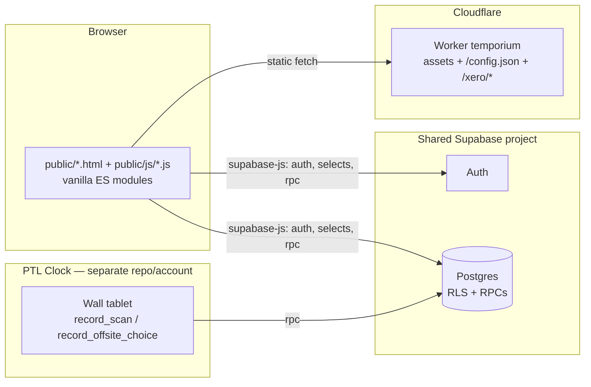
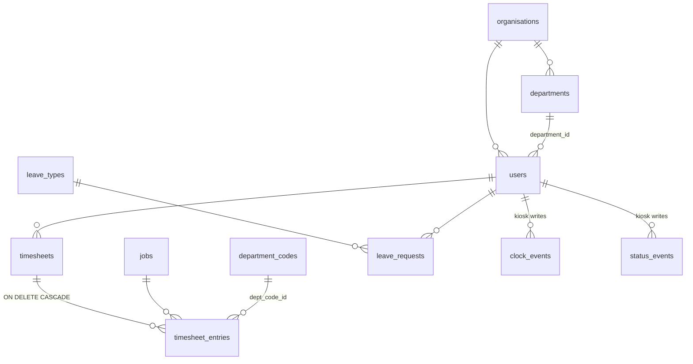

# PTL Timesheet — Developer Guide

## Document control

| | |
|---|---|
| **Version** | 2.0 |
| **Last updated** | 2026-08-04 |
| **Owner** | Ethan Brown (GitHub [`ethanbrown7619-eng`](https://github.com/ethanbrown7619-eng)) |
| **Status** | Living document — bump the version and date with any material change |
| **Applies to** | [`ethanbrown7619-eng/Timeium`](https://github.com/ethanbrown7619-eng/Timeium), deploy branch `claude/continue-ptl-timesheet-blVcV` |

**Change log**

| Version | Date | Change |
|---|---|---|
| 2.0 | 2026-08-04 | Restructured into tutorial / explanation / reference / how-to parts. Added: getting started, RPC reference (split out to [RPC-REFERENCE.md](RPC-REFERENCE.md)), rollback & bad-migration playbooks, backups, troubleshooting index, contribution workflow, security & privacy section, glossary, key links. |
| 1.0 | 2026-06 | Initial guide (architecture, shared-DB rules, deployment, patterns). |

**Key links**

| What | Where |
|---|---|
| This repo | <https://github.com/ethanbrown7619-eng/Timeium> |
| Live app | <https://ptl-timesheet.businessautomation.workers.dev> |
| Supabase dashboard (shared project) | <https://supabase.com/dashboard/project/kyfydyownbgwhquorchn> |
| Cloudflare dashboard (worker `temporium`) | <https://dash.cloudflare.com/> → account `d9f2…f8b6` → Workers & Pages |
| PTL Clock kiosk repo | Separate GitHub + Cloudflare account — coordinate via the owner above |
| Companion docs | [RPC-REFERENCE.md](RPC-REFERENCE.md) · [USER-GUIDE.md](USER-GUIDE.md) · [SECURITY-TESTING.md](SECURITY-TESTING.md) |

**How this guide is organised** (loosely [Diátaxis](https://diataxis.fr/)): Part I is the
getting-started tutorial; Part II explains the architecture; Part III is reference
material (the RPC catalogue lives in its own file so it can be updated independently);
Part IV is how-to and operations; Part V is process; Part VI is security & privacy.
Read Parts I–II once; the **[Shared database](#5-the-shared-database--read-this-twice)**
and **[Migrations](#migration-numbering--the-registry)** material is what will save you
from breaking production.

---

# Part I — Getting started

## 0. Prerequisites & access

You need, in this order:

1. **Git** and a GitHub account with access to
   [`ethanbrown7619-eng/Timeium`](https://github.com/ethanbrown7619-eng/Timeium)
   (ask the owner for collaborator access).
2. **Node.js ≥ 18** and npm (the only dev dependency is `wrangler`; there is no
   build step and no other toolchain).
3. **Cloudflare access** — only needed to deploy or read worker logs. `wrangler
   login` opens a browser auth flow; the owner grants you access to the PTL
   Cloudflare account (its account ID is not committed to the repo — once
   granted you'll see it in the dashboard URL).
4. **A Supabase app account** — the app talks to the live shared Supabase project
   directly, so to sign in locally you need a real `public.users` row (and an
   `admins` row if you need admin/dev tools). The owner creates this for you.
   Supabase *dashboard* access (SQL editor — required for applying migrations) is
   granted separately by the owner.

No secrets are required for local development: the Supabase URL and anon key are
public values committed in `wrangler.toml [vars]`, and the worker serves them to
the frontend as `/config.json`.

## 0.1 Run it locally

```sh
git clone https://github.com/ethanbrown7619-eng/Timeium.git
cd Timeium
npm install
npm run dev        # wrangler dev — serves public/ + worker on localhost
```

Open the printed localhost URL and sign in with your app account.

Things to know before you start:

- **Do not clone into a OneDrive-synced folder** (on PTL machines the Desktop is
  redirected into OneDrive, which corrupts `.git`). Use a plain local path.
- **There is no staging database.** `wrangler dev` and the deployed app hit the
  *same live Supabase project*, which is also shared with the PTL Clock kiosk and
  the ERP modules. Anything you write locally is production data. The dev-tools
  "Reset all hours" button deletes real data.
- **There is no build step.** Edit a file under `public/`, refresh the browser.
  Whatever you write runs as-is in evergreen browsers (ES modules and top-level
  `await` are fine).
- Quick syntax check without a browser: `node --check` on a copy of the module
  renamed to `.mjs`.
- Applying database changes is a separate, manual step — see
  [the shared database](#5-the-shared-database--read-this-twice). Pushing code
  never touches the DB.

---

# Part II — Architecture

## 1. The one-paragraph architecture

PTL Timesheet is a **static multi-page app** — plain HTML pages plus vanilla-JS ES
modules, no framework, no build step, no bundler — served by a **Cloudflare
Worker** (`temporium`, live at `ptl-timesheet.businessautomation.workers.dev`).
All data lives in a **Supabase** project (Postgres + Auth + PostgREST) that
is **shared with a second application**: the PTL Clock kiosk,
which lives in a separate repo on a separate GitHub + Cloudflare account.
The browser talks to Supabase directly (anon key + user JWT); privileged
operations go through `SECURITY DEFINER` SQL functions (RPCs) rather than a
server of our own. The Worker only serves assets, `/config.json`, and the
Xero OAuth routes.



## 2. Repo layout

```
public/                 the entire app
  *.html                one file per page (timesheet, leave, admin, …)
  js/*.js               one module per page + shared.js helpers
  js/supabase-client.js client bootstrap (reads /config.json)
  js/vendor/            vendored supabase-js single-file build
  css/style.css         the single stylesheet (design tokens in :root)
supabase/migrations/    numbered SQL files — hand-run, see the shared-DB section
worker.js               the Cloudflare Worker
wrangler.toml           deploy config (assets binding, vars)
schema-replica.sql      snapshot of shared DB objects — goes stale; see caveats
docs/                   this guide, the RPC reference, the user guide,
                        security-testing notes
```

Page ↔ module map (each HTML page loads exactly one module):

| Page | Module | What it is |
|---|---|---|
| `timesheet.html` | `timesheet.js` | The weekly grid. Biggest module. Also powers admin/manager **edit mode** via `?admin=1&user=<id>` (`ADMIN_MODE`) |
| `timesheet-view.html` | `timesheet-view.js` | Read-only view + approve/reject + submit-on-behalf |
| `leave.html` | `leave.js` | Employee requests + manager Team Requests |
| `myclock.html` | `myclock.js` | Own clock events + adjustment requests |
| `timeclock.html` | `timeclock.js` | The Clock tab: live / clock-vs-timesheet / flags / full / off-site / adjustments |
| `admin.html` | `admin.js` | Dashboard, Infusion export, leave oversight, leave/OT reports (incl. the filterable custom report) |
| `staff.html` / `configure.html` | `staff.js` / `configure.js` | Roster + org configuration |
| `department.html` | `department.js` | Manager's weekly approval hub |
| `archive.html`, `settings.html`, auth pages | matching modules | Self-explanatory |

Conventions: modules start with top-level `await` (session → `getUserContext`
→ `renderTopbar`), everything user-visible goes through `notice()` toasts or
inline UI, all HTML built with template literals + `escapeHtml()`. Heavy
libraries (XLSX, jsPDF, qrcode) are **lazy-imported from esm.sh on click**,
never on page load.

## 3. Auth, roles, and authorization

- Supabase Auth owns identity. Two app tables attach meaning:
  `public.users` (the **employee** row, keyed by `auth_user_id`) and
  `public.admins` (admin/developer role per org).
- `getUserContext(sb, session)` in `shared.js` resolves everything the UI
  needs: `employee`, `adminRow`, `isDeveloper`, `isManager`
  (`users.is_manager`), clock visibility, employment-type settings.
- A **manager** is `departments.manager_id = users.id`; server-side checks
  use `user_manages_target_user(target_id)`.
- **Authorization is enforced in the database**, not the UI: RLS policies
  for straightforward row access, `SECURITY DEFINER` RPCs for anything
  crossing user boundaries (approvals, reports, on-behalf actions). Treat
  every UI gate as cosmetic; the RPC must check for real. The full catalogue
  of RPCs — signatures, who may call them, what each enforces — is
  **[RPC-REFERENCE.md](RPC-REFERENCE.md)**; keep it updated when you add or
  change a function.
- Client-side validation is always mirrored server-side when it matters
  (e.g. department-required-on-submit is a DB trigger, migration 148).

## 4. Domain model (the tables you'll touch)



Things that will bite you if you don't know them:

- **Timesheets are week-per-row**: `timesheets(user_id, week_start)` with
  status `draft → submitted → approved/rejected → exported`. Entries carry
  **seven hour columns** (`mon_hours` … `sun_hours`), not one row per day.
- **Hours are quarter-hour steps** — client snaps to 0.25.
- **`users` has TWO department columns**: legacy free-text `department`
  (the old clock app's) and the FK `department_id`. Anything reading
  departments must `coalesce(departments.name, users.department)` —
  migration 149 fixed the clock reports; don't reintroduce the bug.
- **Leave**: single-step approval. `leave_requests.status ∈ pending_employee
  (manager raised it on-behalf) / pending_manager / approved / rejected /
  cancelled` (`pending_admin` is legacy). Approval calls
  `populate_timesheet_for_leave` which writes the hours into the employee's
  timesheet via the leave-type → job mapping; unmapped types (Unpaid Leave)
  approve without touching timesheets. Amendments/cancellations are flags +
  `proposed_*` columns on the same row, actioned by the manager.
- **Clock data** is written *only* by the kiosk RPCs: `clock_events`
  (in/out) and `status_events` (on_site / off_site_break / off_site_job /
  off_site_personal / clocked_out_early).
- **Worked-hours convention** (the single most load-bearing calc): worked =
  raw(first in → last out, minute-rounded) − unpaid breaks (derived from
  org break config) + **15-min early-leave credit** (when ≥15 unpaid mins
  were deducted), rounded to nearest 0.25h. Implemented once as
  `shiftWorkedCalc()` in `timeclock.js` and used by the Full report, Clock
  vs Timesheet, and the Flag report **so no two views can disagree**. If
  you change the calc, change it there and nowhere else.
- **Overtime** (leave/OT report, `admin.js`): weekend hours are all OT;
  weekday hours above the employee's daily threshold (default 8) are OT;
  leave hours never count toward thresholds; `receives_overtime = false`
  employees are skipped.
- **Overhead staff** (overhead departments) don't file timesheets — reports
  pull their approved leave straight from `leave_requests` (and only
  theirs, to avoid double-counting timesheet staff).

---

# Part III — Reference

## The RPC / API reference

**[RPC-REFERENCE.md](RPC-REFERENCE.md)** catalogues every database function the
frontend calls and every `SECURITY DEFINER` function this repo owns: signature,
which migration holds the latest definition, who may call it, and what the body
actually enforces. Because authorization lives in the database, that file is the
authoritative security surface of the app — **update it in the same commit as any
migration that adds or changes a function.**

## Migration numbering — the registry

There is no external registry; **the `supabase/migrations/` folder is the
registry**, and numbers are taken first-come at push time.

| Range | Owner | Notes |
|---|---|---|
| ≤ 199 | **This repo** | Current files run 022–157; next number = highest present + 1. Files below 031 predate the partition agreement but are ours. |
| 200+ | **PTL Clock kiosk repo** | Never number into the 200s. Kiosk-side changes are authored in *their* migration history — coordinate via the owner. |

Rules that keep this honest: one migration per change; every migration idempotent
("safe to re-run"); a header comment saying *why*; never renumber a pushed file.
Because migrations are hand-applied ([see below](#5-the-shared-database--read-this-twice)),
the folder can be ahead of the live DB — to find out what's applied, probe for the
objects each migration creates.

## Environment variables & secrets

| Name | Sensitivity | Where it lives | Purpose |
|---|---|---|---|
| `SUPABASE_URL` | Public | `wrangler.toml [vars]` | Shared project URL, served via `/config.json` |
| `SUPABASE_ANON_KEY` | Public (RLS is the gate) | `wrangler.toml [vars]` | Browser Supabase client |
| `TURNSTILE_SITE_KEY` | Public | `wrangler.toml [vars]` | CAPTCHA widget on auth forms |
| `SUPABASE_SERVICE_ROLE_KEY` | **Secret — bypasses RLS entirely** | `wrangler secret put` | Worker-side Xero routes |
| `XERO_CLIENT_ID` / `XERO_CLIENT_SECRET` | **Secret** | `wrangler secret put` | Xero OAuth |
| Turnstile *secret* key | **Secret** | Supabase Auth settings (dashboard) | Server-side CAPTCHA verification |

---

# Part IV — Working on the system

## 5. The shared database — read this twice

The Supabase project is shared with the **PTL Clock kiosk repo** (different
GitHub account; you cannot see its code). This has real consequences:

**Migrations are hand-applied.** Pushing code does *not* touch the DB.
Every `supabase/migrations/NNN_*.sql` file must be pasted into the
[Supabase SQL editor](https://supabase.com/dashboard/project/kyfydyownbgwhquorchn)
by a human. Write every migration idempotent ("safe to re-run").

**Numbering is partitioned** — see [the registry](#migration-numbering--the-registry).

**Function ownership is split** (agreed with the PTL Clock side):

| Owner | Functions |
|---|---|
| **PTL Clock** | The kiosk write path: `record_scan`, `record_offsite_choice`, `admin_add_clock_event`, auto-close functions |
| **PTL Timesheet** | The read/report functions: `_offsite_report`, `_timesheet_rows`, `org_live_status` — noting PTL Clock's admin dashboard also consumes them |

Never `CREATE OR REPLACE` a function the other side owns. If a kiosk-side
change is needed, coordinate — they author it in their migration history.

**The overload trap (learned the hard way).** Postgres treats same-name
functions with different parameter lists as *coexisting overloads*. If you
recreate a shared function from a stale copy of its signature you don't
replace it — you mint a twin, and every RPC call then fails with *"could
not choose best candidate function"* (this took the kiosk down once). And
if the signature *does* match but your copy is stale, you silently revert
the other repo's features — worse, because nothing errors (this happened
to `_timesheet_rows`, reverting unpaid-personal-time deduction).

**Rule: before touching any shared function, snapshot it from the live DB**
— never from `schema-replica.sql` (a point-in-time reference that goes
stale; its snapshot date is in its own header and in git history) and never
from memory:

```sql
select pg_get_functiondef(p.oid) from pg_proc p
 where p.pronamespace = 'public'::regnamespace
   and p.proname in ('record_scan','record_offsite_choice','_offsite_report',
                     '_timesheet_rows','org_live_status');
```

Run that after any deploy from either side and commit the output to
`schema-replica.sql` so the snapshot stays truthful.

**Checking what's applied:** there's no migration table for hand-applied
files — probe for the objects each migration creates (`pg_proc` /
`pg_trigger` / `information_schema.columns`, matching on
`pg_get_functiondef` text for redefinitions).

## 6. The two-repo copy workflow

The PTL Clock repo also serves a *copy* of this timesheet frontend on its
own Cloudflare account. There is no automation: after a change here, the
touched `public/` files are **manually copied** into the B repo by the
owner. When you finish a change, list the exact files to copy. DB
migrations run **once** (shared database covers both). The B repo's
`wrangler.toml` is its own (different worker, different Cloudflare
account) — never copy that file across.

## 7. Deployment & environment

- `wrangler deploy` publishes worker + assets; pushes to the deploy branch
  (`claude/continue-ptl-timesheet-blVcV`) deploy via Cloudflare's git
  integration — **every push is a deploy**.
- `wrangler.toml`: assets served worker-free (`run_worker_first` is
  intentionally OFF — turning it on once 503'd the site); the `ASSETS`
  binding is required for `worker.js`'s fallthrough; `[vars]` exposes the
  public Supabase URL + anon key, which the Worker serves as
  `/config.json`; secrets via `wrangler secret put` (see
  [the table above](#environment-variables--secrets)).
- Supabase Auth **URL Configuration** must list the real app origin as Site
  URL and `https://<origin>/*` in Redirect URLs — otherwise password-reset
  emails bounce to the wrong place (this shipped broken as
  `localhost:3000` once).
- Turnstile (CAPTCHA) protects auth forms; the public site key lives in
  `wrangler.toml`, the secret in Supabase Auth settings.

## 7a. Rolling back

**Frontend / worker** (safe, fast):

1. `git revert <bad commit>` and push to the deploy branch — Cloudflare
   redeploys the previous state. This is the preferred route because the repo
   history stays truthful.
2. In a hurry: `npx wrangler rollback` reverts the worker to the previous
   deployment, or check out the last good commit and `npx wrangler deploy`.
   Verify with `npx wrangler deployments list`. Follow up with the git revert
   so the next push doesn't re-deploy the bad code.

**Database** — there is no automatic rollback. Migrations are hand-applied, so
recovery is **forward-fix**: write a new idempotent migration that corrects the
state, apply it, and commit it. Never edit an already-applied migration to
pretend it didn't happen. For the specific failure modes, use the playbook below.

## 7b. Bad-migration playbook (incident response)

You applied a migration to the shared DB and something broke — possibly the
kiosk or an ERP sibling app, not just this one.

1. **Stop applying anything else.** One bad state is recoverable; a guessed
   second change on top may not be.
2. **Identify what actually changed.** Snapshot the affected functions from the
   live DB (`pg_get_functiondef`, query in
   [the shared-DB section](#5-the-shared-database--read-this-twice)) and diff
   against `schema-replica.sql` / the migration you ran.
3. **"could not choose best candidate function"** → you minted an overload
   twin. List them and drop the one with the stale signature:

   ```sql
   select p.oid::regprocedure
     from pg_proc p
    where p.pronamespace = 'public'::regnamespace
      and p.proname = '<function>';
   -- then: drop function public.<function>(<stale arg list>);
   ```

4. **Silently clobbered a shared function** (signature matched, body stale) →
   restore from the authoritative source: the owning repo's latest migration,
   or ask the kiosk owner for their current definition. Do not restore from
   `schema-replica.sql` unless its date proves it post-dates the other side's
   last change.
5. **Verify both apps** — this app *and* the kiosk (and, for `public.*`
   objects, the ERP modules) — before calling it fixed.
6. **Close out:** write the corrected idempotent migration, commit it, refresh
   `schema-replica.sql`, and note what happened in the migration's header
   comment so the next person understands the scar tissue.

## 7c. Backups & data recovery

- Supabase takes automated backups of the project — see
  [Dashboard → Database → Backups](https://supabase.com/dashboard/project/kyfydyownbgwhquorchn/database/backups)
  for what's available on the current plan (daily backups; point-in-time
  recovery only if enabled).
- **A restore rolls back every application sharing the project** — the kiosk
  and the ERP modules included — to the backup's timestamp. It is the last
  resort, coordinated by the owner; prefer surgical repair (playbook above)
  for anything short of data destruction.
- Before running anything destructive (bulk deletes, `Reset all hours`,
  risky migrations), export the affected rows first — a `select … \copy` from
  the SQL editor or a CSV export is cheap insurance.
- Remember the retention obligations in
  [Security & privacy](#part-vi--security--privacy) before deleting employee
  records at all.

## 8. Frontend patterns & gotchas

- **No build step.** Whatever you write runs as-is in the browser. Target
  modern evergreen browsers; ES modules + top-level await are fine.
- **supabase-js is vendored** (`public/js/vendor/supabase-js.js`, built
  with esbuild from `@supabase/supabase-js`) so no CDN sits in the critical
  path. Regenerate the same way to upgrade.
- **The 1000-row cap.** PostgREST silently truncates selects at 1000 rows.
  Any query that can exceed it must chunk (see `ENTRY_CHUNK` /
  `WEEK_CHUNK` in `admin.js`) and call `flagTruncationRisk()`.
- **Ambiguous FK embeds.** `leave_requests` has several FKs to `users` and
  two to `leave_types` — embedded selects must pin the constraint:
  `users!leave_requests_user_id_fkey(name)`.
- **PostgREST schema cache**: after running a migration that adds/changes
  RPCs, Supabase reloads the schema automatically, but give it a moment
  before declaring your new RPC "missing".
- **Styling**: one stylesheet, design tokens in `:root` (PTL lime
  `#BEFA40`, surfaces, shadows, radii). Lime is an *accent* — no washes or
  glows. Tables center-aligned; `.num` cells use tabular numerals. Reuse
  existing components (`.card`, `.dept-badge`, `.tabs.sub`, `.panel-status`,
  `.lv-filter-menu`) before inventing new ones.
- **Toasts vs inline**: transient feedback via `notice(msg, level)`; panel
  summaries use the compact `.panel-status` pill, not banners.
- **Caching**: `fetchWeekDashboardData` memoizes the week dashboard (~30s
  TTL) — call `invalidateWeekDashboard(orgId)` after anything that changes
  timesheets, or the UI shows stale data.
- **Danger zones**: `timesheet_entries.timesheet_id` is ON DELETE CASCADE;
  the dev "Reset all hours" tool deletes *real* data too.

## 9. Testing & debugging

- No automated test suite. Verify by running against the real app
  (a dev-role account sees extra tools).
- **Admin → Dev Tools → Generate Test Timesheets** creates realistic
  timesheets (jobs, leave, overtime) for a department/week; "Reset all
  hours" wipes them (and everything else — careful).
- Quick syntax check without a browser: `node --check` on a copy of the
  module renamed to `.mjs`.
- Worker logs: Cloudflare dashboard → Observability (100% sampling is on).
- DB debugging: the Supabase SQL editor against the live schema — remember
  `plpgsql` bodies aren't fully validated at `CREATE`; ambiguity and
  column errors surface on **first execution**.

## 9a. Troubleshooting index

| Symptom | Likely cause | Fix |
|---|---|---|
| RPC calls fail with *"could not choose best candidate function"* | Overload twin minted from a stale signature | [Bad-migration playbook](#7b-bad-migration-playbook-incident-response) step 3 |
| A feature in the *other* app silently reverted | Shared function clobbered with a stale body | Playbook step 4 |
| New RPC "missing" right after applying a migration | PostgREST schema cache hasn't reloaded | Wait a moment; retry. Persisting → check the migration actually ran and `GRANT EXECUTE` exists |
| Whole site 503s | `run_worker_first` turned on / `ASSETS` binding missing | Keep `run_worker_first` OFF; keep the `[assets] binding = "ASSETS"` line |
| Password-reset email links to the wrong host | Supabase Auth URL Configuration stale | Set Site URL + `https://<origin>/*` redirect |
| Report/table quietly missing rows | PostgREST 1000-row cap | Chunk the query; `flagTruncationRisk()` |
| Embedded select errors about multiple relationships | Ambiguous FK embed | Pin the constraint name (`users!leave_requests_user_id_fkey`) |
| Week dashboard shows stale data after an edit | Memoized `fetchWeekDashboardData` | `invalidateWeekDashboard(orgId)` after mutating |
| Migration ran but behaviour unchanged | It was never applied (hand-apply is manual) | Probe `pg_proc` / `information_schema` for the objects it creates |

---

# Part V — Contribution workflow

- **Branching.** The canonical branch is `claude/continue-ptl-timesheet-blVcV`
  and Cloudflare auto-deploys every push to it. Small, verified changes may go
  straight to it (accepting that push = deploy). Anything you can't fully verify
  locally goes on a feature branch first and merges when ready. Don't rename the
  deploy branch — the Cloudflare git integration is bound to it.
- **Commits.** Imperative subject line; body explains *why*, not what. A change
  that includes a migration references its number in the subject or body.
  User-visible frontend changes end by listing the exact `public/` files to copy
  to the B repo ([two-repo workflow](#6-the-two-repo-copy-workflow)).
- **Review.** There is no CI and no test suite, so review discipline substitutes
  for both: verify against the live app with a dev-role account before pushing;
  anything touching the shared DB, money/hours calculations
  (`shiftWorkedCalc()`), or auth gets a second pair of eyes (human or a fresh
  adversarial AI review) before the migration is applied.
- **Migrations.** Take the next free number ([registry](#migration-numbering--the-registry)),
  make it idempotent, header-comment the why, and never edit an applied file —
  forward-fix instead. Applying to the live DB is its own deliberate act,
  separate from pushing.
- **Documentation.** A change that alters behaviour described here updates this
  guide (and [RPC-REFERENCE.md](RPC-REFERENCE.md) for function changes) in the
  same commit, and bumps the version in [Document control](#document-control).

---

# Part VI — Security & privacy

**Public vs secret.** The split is deliberate: the Supabase URL, anon key, and
Turnstile site key are public by design (RLS and the DB-side RPC checks are the
real gate — see the [env table](#environment-variables--secrets)). Everything
else is secret. The **service-role key bypasses RLS entirely**: it exists only
as a Cloudflare worker secret for the Xero routes, must never appear in
`public/`, `wrangler.toml`, or a commit, and access to it is effectively access
to every row in the shared database. Who holds it: whoever has access to the
Cloudflare account and the Supabase dashboard (currently the owner). Rotate it
from the Supabase dashboard if it ever leaks, then update the worker secret.

**This is employee PII.** The database holds identified employee records: hours
worked, clock in/out times, on-site/off-site status, and leave — including sick
leave, which is health-adjacent information. Under the NZ **Privacy Act 2020**
that carries real obligations: collect only what's needed, secure it, and be
able to answer an employee's access/correction request (the data model makes
this feasible — everything keys off `users.id`). Under the **Holidays Act 2003**
and **Employment Relations Act 2000**, holiday/leave and wages & time records
must be kept for **at least 6 years** — so features must not hard-delete
timesheet, leave, or clock history for departed employees; deactivate accounts
instead of purging them, and treat the dev "Reset all hours" tool as strictly a
test-data tool.

**Practical hygiene.**

- Don't paste real employee data into external tools or services when a test
  employee (Dev Tools → Generate Test Timesheets) will do.
- Offboarding a developer = removing GitHub collaborator access, Cloudflare
  account access, Supabase dashboard access, and deactivating their app account.
- New privileged surface (a new `SECURITY DEFINER` RPC, a new worker route using
  the service-role key) gets an entry in [RPC-REFERENCE.md](RPC-REFERENCE.md)
  and a mention in the commit for reviewability.
- Historical security testing notes live in
  [SECURITY-TESTING.md](SECURITY-TESTING.md).

---

# Glossary

| Term | Meaning |
|---|---|
| **PTL** | The company this system serves. One organisation row; everything runs under it. |
| **Timeium / `temporium`** | This repo / its Cloudflare Worker name. The app is "PTL Timesheet" to users. |
| **PTL Clock / kiosk / Attendium** | The wall-tablet clock-in/out app. Separate repo + Cloudflare account, **same database**. Writes `clock_events` / `status_events`. |
| **B repo** | The kiosk-side copy of this frontend, served from the kiosk's Cloudflare account ([two-repo workflow](#6-the-two-repo-copy-workflow)). |
| **Infusion** | PTL's accounting system. Admin exports timesheet data to it; unrelated to this app's internals. |
| **Xero** | Payroll/accounting SaaS; the worker's `/xero/*` routes handle its OAuth + API for leave export. |
| **Turnstile** | Cloudflare's CAPTCHA, on the auth forms. |
| **Supabase** | Hosted Postgres + Auth + PostgREST. The shared project is `kyfydyownbgwhquorchn`. |
| **PostgREST** | The REST layer Supabase puts over Postgres — what supabase-js talks to. Source of the 1000-row cap. |
| **RLS** | Row-Level Security — per-row Postgres policies; the baseline authorization layer. |
| **RPC** | A Postgres function called via PostgREST (`sb.rpc('name')`). |
| **`SECURITY DEFINER`** | A Postgres function running with its owner's rights, not the caller's — used for privileged operations, which is why each one must check authorization itself. |
| **Anon key / service-role key** | Supabase API keys: the anon key is public and RLS-bound; the service-role key bypasses RLS and is strictly secret. |
| **Overhead staff** | Employees in overhead departments who don't file timesheets; reports read their leave directly. |
| **wrangler** | Cloudflare's CLI — dev server, deploys, secrets, logs. |

---

# 10. Where to start reading

1. `public/js/shared.js` — every cross-page helper: context, topbar, dates
   (`getMonday`, `fmtDate`, `DAYS`), `leaveTotalHours`, dialogs, toasts.
2. `public/js/timesheet.js` — the grid: entries model, autosave, submit
   validation, admin mode.
3. `public/js/timeclock.js` — `shiftWorkedCalc()` and the report tabs.
4. `supabase/migrations/` in order — the DB's real history, including the
   comments documenting why each change exists.
5. [`docs/RPC-REFERENCE.md`](RPC-REFERENCE.md) — the authorization surface.
6. [`docs/USER-GUIDE.md`](USER-GUIDE.md) — the flows you're about to modify, as
   users see them.
