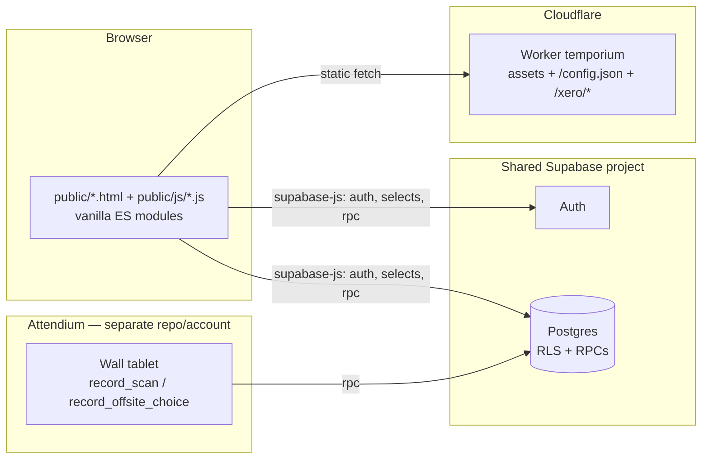
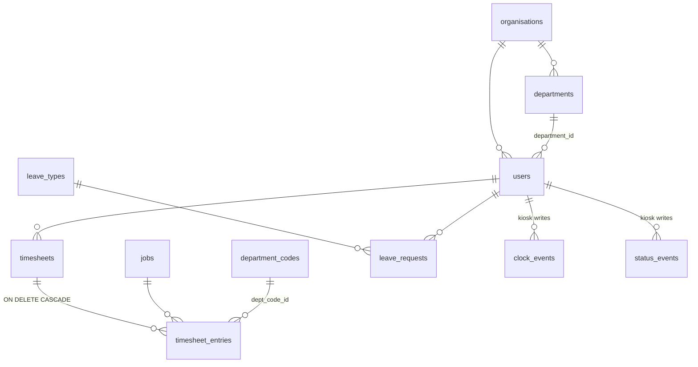

# PTL Timesheet — Developer Guide

What you need to know before working on this codebase. Read the whole
thing once; the **Shared database** and **Migrations** sections are the
ones that will save you from breaking production.

---

## 1. The one-paragraph architecture

Timeium is a **static multi-page app** — plain HTML pages plus vanilla-JS ES
modules, no framework, no build step, no bundler — served by a **Cloudflare
Worker** (`temporium`, live at `ptl-timesheet.businessautomation.workers.dev`).
All data lives in a **Supabase** project (Postgres + Auth + PostgREST) that
is **shared with a second application**: the Attendium clock-in/out kiosk,
which lives in a separate repo on a separate GitHub + Cloudflare account.
The browser talks to Supabase directly (anon key + user JWT); privileged
operations go through `SECURITY DEFINER` SQL functions (RPCs) rather than a
server of our own. The Worker only serves assets, `/config.json`, and the
Xero OAuth routes.



## 2. Repo layout

```
public/                 the entire app
  *.html                one file per page (timesheet, leave, admin, …)
  js/*.js               one module per page + shared.js helpers
  js/supabase-client.js client bootstrap (reads /config.json)
  js/vendor/            vendored supabase-js single-file build
  css/style.css         the single stylesheet (design tokens in :root)
supabase/migrations/    numbered SQL files — hand-run, see §5
worker.js               the Cloudflare Worker
wrangler.toml           deploy config (assets binding, vars)
schema-replica.sql      snapshot of shared DB objects — see §5 caveats
docs/                   this guide + the user guide
```

Page ↔ module map (each HTML page loads exactly one module):

| Page | Module | What it is |
|---|---|---|
| `timesheet.html` | `timesheet.js` | The weekly grid. Biggest module. Also powers admin/manager **edit mode** via `?admin=1&user=<id>` (`ADMIN_MODE`) |
| `timesheet-view.html` | `timesheet-view.js` | Read-only view + approve/reject + submit-on-behalf |
| `leave.html` | `leave.js` | Employee requests + manager Team Requests |
| `myclock.html` | `myclock.js` | Own clock events + adjustment requests |
| `timeclock.html` | `timeclock.js` | The Clock tab: live / clock-vs-timesheet / flags / full / off-site / adjustments |
| `admin.html` | `admin.js` | Dashboard, Infusion export, leave oversight, leave/OT reports (incl. the filterable custom report) |
| `staff.html` / `configure.html` | `staff.js` / `configure.js` | Roster + org configuration |
| `department.html` | `department.js` | Manager's weekly approval hub |
| `archive.html`, `settings.html`, auth pages | matching modules | Self-explanatory |

Conventions: modules start with top-level `await` (session → `getUserContext`
→ `renderTopbar`), everything user-visible goes through `notice()` toasts or
inline UI, all HTML built with template literals + `escapeHtml()`. Heavy
libraries (XLSX, jsPDF, qrcode) are **lazy-imported from esm.sh on click**,
never on page load.

## 3. Auth, roles, and authorization

- Supabase Auth owns identity. Two app tables attach meaning:
  `public.users` (the **employee** row, keyed by `auth_user_id`) and
  `public.admins` (admin/developer role per org).
- `getUserContext(sb, session)` in `shared.js` resolves everything the UI
  needs: `employee`, `adminRow`, `isDeveloper`, `isManager`
  (`users.is_manager`), clock visibility, employment-type settings.
- A **manager** is `departments.manager_id = users.id`; server-side checks
  use `user_manages_target_user(target_id)`.
- **Authorization is enforced in the database**, not the UI: RLS policies
  for straightforward row access, `SECURITY DEFINER` RPCs for anything
  crossing user boundaries (approvals, reports, on-behalf actions). Treat
  every UI gate as cosmetic; the RPC must check for real.
- Client-side validation is always mirrored server-side when it matters
  (e.g. department-required-on-submit is a DB trigger, migration 148).

## 4. Domain model (the tables you'll touch)



Things that will bite you if you don't know them:

- **Timesheets are week-per-row**: `timesheets(user_id, week_start)` with
  status `draft → submitted → approved/rejected → exported`. Entries carry
  **seven hour columns** (`mon_hours` … `sun_hours`), not one row per day.
- **Hours are quarter-hour steps** — client snaps to 0.25.
- **`users` has TWO department columns**: legacy free-text `department`
  (the old clock app's) and the FK `department_id`. Anything reading
  departments must `coalesce(departments.name, users.department)` —
  migration 149 fixed the clock reports; don't reintroduce the bug.
- **Leave**: single-step approval. `leave_requests.status ∈ pending_employee
  (manager raised it on-behalf) / pending_manager / approved / rejected /
  cancelled` (`pending_admin` is legacy). Approval calls
  `populate_timesheet_for_leave` which writes the hours into the employee's
  timesheet via the leave-type → job mapping; unmapped types (Unpaid Leave)
  approve without touching timesheets. Amendments/cancellations are flags +
  `proposed_*` columns on the same row, actioned by the manager.
- **Clock data** is written *only* by the kiosk RPCs: `clock_events`
  (in/out) and `status_events` (on_site / off_site_break / off_site_job /
  off_site_personal / clocked_out_early).
- **Worked-hours convention** (the single most load-bearing calc): worked =
  raw(first in → last out, minute-rounded) − unpaid breaks (derived from
  org break config) + **15-min early-leave credit** (when ≥15 unpaid mins
  were deducted), rounded to nearest 0.25h. Implemented once as
  `shiftWorkedCalc()` in `timeclock.js` and used by the Full report, Clock
  vs Timesheet, and the Flag report **so no two views can disagree**. If
  you change the calc, change it there and nowhere else.
- **Overtime** (leave/OT report, `admin.js`): weekend hours are all OT;
  weekday hours above the employee's daily threshold (default 8) are OT;
  leave hours never count toward thresholds; `receives_overtime = false`
  employees are skipped.
- **Overhead staff** (overhead departments) don't file timesheets — reports
  pull their approved leave straight from `leave_requests` (and only
  theirs, to avoid double-counting timesheet staff).

## 5. The shared database — read this twice

The Supabase project is shared with the **Attendium kiosk repo** (different
GitHub account; you cannot see its code). This has real consequences:

**Migrations are hand-applied.** Pushing code does *not* touch the DB.
Every `supabase/migrations/NNN_*.sql` file must be pasted into the Supabase
SQL editor by a human. Write every migration idempotent ("safe to re-run").

**Numbering is partitioned.** This repo uses **031–199**. Attendium owns
**200+**. Never number into the 200s.

**Function ownership is split** (agreed with the Attendium side):

| Owner | Functions |
|---|---|
| **Attendium** | The kiosk write path: `record_scan`, `record_offsite_choice`, `admin_add_clock_event`, auto-close functions |
| **Timeium** | The read/report functions: `_offsite_report`, `_timesheet_rows`, `org_live_status` — noting Attendium's admin dashboard also consumes them |

Never `CREATE OR REPLACE` a function the other side owns. If a kiosk-side
change is needed, coordinate — they author it in their migration history.

**The overload trap (learned the hard way).** Postgres treats same-name
functions with different parameter lists as *coexisting overloads*. If you
recreate a shared function from a stale copy of its signature you don't
replace it — you mint a twin, and every RPC call then fails with *"could
not choose best candidate function"* (this took the kiosk down once). And
if the signature *does* match but your copy is stale, you silently revert
the other repo's features — worse, because nothing errors (this happened
to `_timesheet_rows`, reverting unpaid-personal-time deduction).

**Rule: before touching any shared function, snapshot it from the live DB**
— never from `schema-replica.sql` (a point-in-time reference that goes
stale) and never from memory:

```sql
select pg_get_functiondef(p.oid) from pg_proc p
 where p.pronamespace = 'public'::regnamespace
   and p.proname in ('record_scan','record_offsite_choice','_offsite_report',
                     '_timesheet_rows','org_live_status');
```

Run that after any deploy from either side and commit the output to
`schema-replica.sql` so the snapshot stays truthful.

**Checking what's applied:** there's no migration table for hand-applied
files — probe for the objects each migration creates (`pg_proc` /
`pg_trigger` / `information_schema.columns`, matching on
`pg_get_functiondef` text for redefinitions).

## 6. The two-repo copy workflow

The Attendium repo also serves a *copy* of this timesheet frontend on its
own Cloudflare account. There is no automation: after a change here, the
touched `public/` files are **manually copied** into the B repo by the
owner. When you finish a change, list the exact files to copy. DB
migrations run **once** (shared database covers both). The B repo's
`wrangler.toml` must keep its own `account_id` — don't copy that file.

## 7. Deployment & environment

- `wrangler deploy` publishes worker + assets; pushes to the default branch
  deploy via Cloudflare's git integration.
- `wrangler.toml`: assets served worker-free (`run_worker_first` is
  intentionally OFF — turning it on once 503'd the site); the `ASSETS`
  binding is required for `worker.js`'s fallthrough; `[vars]` exposes the
  public Supabase URL + anon key, which the Worker serves as
  `/config.json`; secrets (`SUPABASE_SERVICE_ROLE_KEY`, Xero creds) via
  `wrangler secret put`.
- Supabase Auth **URL Configuration** must list the real app origin as Site
  URL and `https://<origin>/*` in Redirect URLs — otherwise password-reset
  emails bounce to the wrong place (this shipped broken as
  `localhost:3000` once).
- Turnstile (CAPTCHA) protects auth forms; the public site key lives in
  `wrangler.toml`, the secret in Supabase Auth settings.

## 8. Frontend patterns & gotchas

- **No build step.** Whatever you write runs as-is in the browser. Target
  modern evergreen browsers; ES modules + top-level await are fine.
- **supabase-js is vendored** (`public/js/vendor/supabase-js.js`, built
  with esbuild from `@supabase/supabase-js`) so no CDN sits in the critical
  path. Regenerate the same way to upgrade.
- **The 1000-row cap.** PostgREST silently truncates selects at 1000 rows.
  Any query that can exceed it must chunk (see `ENTRY_CHUNK` /
  `WEEK_CHUNK` in `admin.js`) and call `flagTruncationRisk()`.
- **Ambiguous FK embeds.** `leave_requests` has several FKs to `users` and
  two to `leave_types` — embedded selects must pin the constraint:
  `users!leave_requests_user_id_fkey(name)`.
- **PostgREST schema cache**: after running a migration that adds/changes
  RPCs, Supabase reloads the schema automatically, but give it a moment
  before declaring your new RPC "missing".
- **Styling**: one stylesheet, design tokens in `:root` (PTL lime
  `#BEFA40`, surfaces, shadows, radii). Lime is an *accent* — no washes or
  glows. Tables center-aligned; `.num` cells use tabular numerals. Reuse
  existing components (`.card`, `.dept-badge`, `.tabs.sub`, `.panel-status`,
  `.lv-filter-menu`) before inventing new ones.
- **Toasts vs inline**: transient feedback via `notice(msg, level)`; panel
  summaries use the compact `.panel-status` pill, not banners.
- **Caching**: `fetchWeekDashboardData` memoizes the week dashboard (~30s
  TTL) — call `invalidateWeekDashboard(orgId)` after anything that changes
  timesheets, or the UI shows stale data.
- **Danger zones**: `timesheet_entries.timesheet_id` is ON DELETE CASCADE;
  the dev "Reset all hours" tool deletes *real* data too.

## 9. Testing & debugging

- No automated test suite. Verify by running against the real app
  (a dev-role account sees extra tools).
- **Admin → Dev Tools → Generate Test Timesheets** creates realistic
  timesheets (jobs, leave, overtime) for a department/week; "Reset all
  hours" wipes them (and everything else — careful).
- Quick syntax check without a browser: `node --check` on a copy of the
  module renamed to `.mjs`.
- Worker logs: Cloudflare dashboard → Observability (100% sampling is on).
- DB debugging: the Supabase SQL editor against the live schema — remember
  `plpgsql` bodies aren't fully validated at `CREATE`; ambiguity and
  column errors surface on **first execution**.

## 10. Where to start reading

1. `public/js/shared.js` — every cross-page helper: context, topbar, dates
   (`getMonday`, `fmtDate`, `DAYS`), `leaveTotalHours`, dialogs, toasts.
2. `public/js/timesheet.js` — the grid: entries model, autosave, submit
   validation, admin mode.
3. `public/js/timeclock.js` — `shiftWorkedCalc()` and the report tabs.
4. `supabase/migrations/` in order — the DB's real history, including the
   comments documenting why each change exists.
5. `docs/USER-GUIDE.md` — the flows you're about to modify, as users see
   them.
