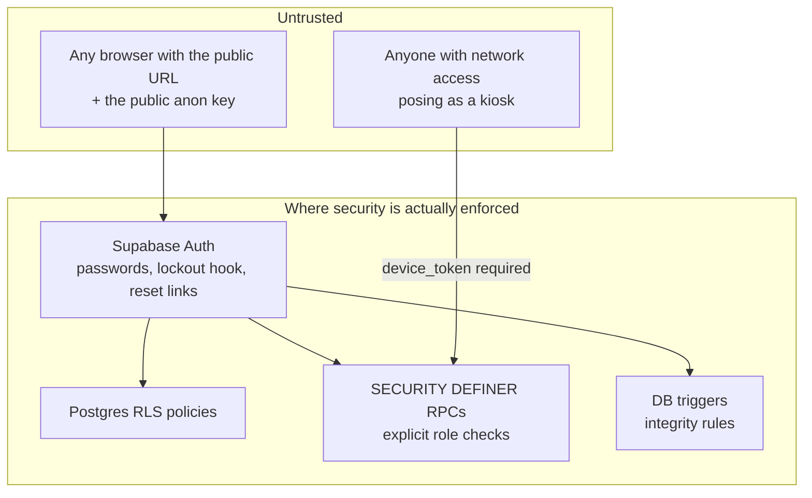

# PTL Timesheet — Security Testing & Posture

How security is tested on PTL Timesheet (and the shared database it
operates with PTL Clock), what has been found and fixed, the controls
currently in place, and the honest list of what is *not* yet covered.

This document describes real, performed activity — nothing here claims a
test that didn't happen. Where a control is partial or advisory, it says
so.

---

## 1. Scope and threat model

**In scope:** the PTL Timesheet web app, the shared Supabase project
(Postgres, Auth, RPCs, RLS), the Cloudflare Worker (assets, `/config.json`,
Xero OAuth routes), and the database surface the PTL Clock kiosk calls.
The kiosk device/app itself is owned and tested by the PTL Clock side.

**Trust boundaries** (everything below the browser line is untrusted):

The governing principle, verified repeatedly in testing: **the UI is not a
security control.** Anyone can call PostgREST directly with the public
anon key, so every protection must hold at the database — RLS for row
access, explicit auth checks inside every `SECURITY DEFINER` function,
and triggers for integrity rules (e.g. department-required-on-submit,
migration 148).

**Assets we protect:** employee PII (names, emails, rates), payroll data
(hours, leave, overtime), org secrets (SMTP credentials, webhook keys,
Xero tokens), and the integrity of clock events (they drive pay).

## 2. How security is tested

There is no automated security test suite; testing is **manual and
code-audit driven**, in four forms:

1. **Security audit of the database surface.** A systematic review of
   every RPC and RLS policy, with particular attention to functions
   callable by `anon` (pre-login) and to `SECURITY DEFINER` functions
   (which bypass RLS and must do their own checks). This audit produced
   the graded findings in §3 (C=critical, H=high, M=medium, L=low), each
   remediated in a numbered migration whose header documents the finding
   verbatim — the migration history doubles as the audit log.
2. **Role-matrix access testing.** Exercising the app as each role
   (employee, manager, admin, developer, clock-viewer) and confirming
   both the UI scope *and* the underlying data scope: what a manager's
   RPC calls return for someone outside their team, whether an employee
   can action another employee's leave, whether a non-admin can reach
   admin RPCs. New role-crossing features (approve-on-behalf,
   request-on-behalf, team change requests) are tested this way before
   release.
3. **Auth-flow testing.** Sign-in, temp-password provisioning, forced
   password change, lockout behaviour, password reset end-to-end
   (including the redirect allow-list, which testing found misconfigured
   — see §3), and the Xero OAuth round-trip.
4. **Incident-driven verification.** When something breaks in a way that
   touches trust (e.g. the shared-function overload incident), the fix
   ships with a verification query the operator runs against the live
   database, and the class of failure is written into the developer
   guide's rules.

Verification of applied database changes is itself testable: because
migrations are hand-applied, we probe the live catalog
(`pg_proc` / `pg_trigger` / `pg_get_functiondef`) to confirm which
security fixes are actually active, not just present in the repo.

## 3. Audit findings and remediations

Findings from the database-surface security audit, in severity order.
All are remediated; the migration column is the authoritative record.

| ID | Severity | Finding | Remediation | Fixed in |
|----|-------|--------------------|--------------------|-----|
| C1 | Critical | `organisations` SELECT policy was `using (true)` — any authenticated user could read every org's plaintext SMTP password and jobs/tasks/dept-codes webhook keys; a stolen webhook key let a regular employee overwrite org data via the anon ingest RPCs | Secrets moved to a dedicated `org_secrets` table readable only by org admins (service_role for edge functions); old columns nulled so lingering readers get NULL, not data. All exposed SMTP passwords and webhook keys rotated and treated as disclosed | 141 |
| H1 | High | Provisioning and admin resets set the literal shared password `PASSWORD`, and the forced-change flag was enforced client-side only — fresh accounts were takeover-able via direct `/auth/v1/token` calls before first login | Random 12-character one-time password per user, returned once to the admin for out-of-band delivery; no shared credential exists to pre-authenticate with | 140 |
| M3 | Medium | `record_login_attempt` was anon-callable and trusted a client-supplied success flag and arbitrary email — attackers could pollute forensics with fake successes or forge failures against a victim | Anon endpoint records failures only; successes recorded by a separate authenticated RPC that derives the email from `auth.uid()` | 139 |
| H1/M3 | Follow-up | The account lockout was advisory (checked client-side), so direct token-endpoint calls bypassed it | A Supabase *Password Verification Attempt* auth hook makes the auth server itself the recorder of attempts and **rejects sign-in when locked** (5 failures / 15 min), closing the bypass. Requires one-time enabling in the dashboard (Authentication → Hooks) | 142 |
| L5 | Low | The Xero OAuth `state` token carried a nonce that was never checked — a captured state was replayable for its 600-second TTL | Callback burns each nonce on first use (`xero_oauth_used_states`, service_role only); replays rejected | 143 |

Additional issues found and fixed outside the graded audit:

- **Password-reset links were dead on arrival** — Supabase's Site URL was
  still `http://localhost:3000` with an empty redirect allow-list, so
  every emailed link bounced to localhost. Fixed in configuration (real
  origin + wildcard allow-list); the client also now forwards a recovery
  token to the reset page from wherever it lands, and surfaces the real
  error (e.g. a link consumed by a corporate email scanner) instead of a
  generic failure.
- **Payroll-integrity rule bypassable on behalf** — submit-on-behalf could
  skip the department-code requirement; now enforced by a DB trigger so
  no client path can bypass it (migration 148).

## 4. Standing controls (what testing verifies stays true)

**Authentication.** Email + password via Supabase Auth; Cloudflare
Turnstile CAPTCHA on the auth forms; random per-user temp passwords with
a forced change on first login; binding server-side lockout via the
auth hook (142); single-use, expiring password-reset links.

**Authorization.** RLS on app tables; every `SECURITY DEFINER` RPC
re-checks the caller (`is_admin_of`, `user_manages_target_user`, or
row-ownership via `auth.uid()`) before acting — approval, on-behalf, and
report functions all gate server-side. Client checks exist only for UX.

**Kiosk write path** (PTL Clock's functions, same database): every call
requires a registered `device_token`; scans are rate-limited by a
per-user cooldown; timestamps are clamped (future → now, >48h old →
rejected); replayed events older than the user's newest event are
refused (`stale_replay`) so history can't be rewritten out of order.

**Secrets.** Org secrets live in the admin-only `org_secrets` table;
Worker secrets (service-role key, Xero credentials) are Cloudflare
secrets, never in the repo; the Supabase URL and anon key are public by
design (safety rests on RLS/RPC checks, per the trust model above). The
service-role key is used only by the Worker's Xero routes against a
table locked to service_role.

**Web client.** All dynamic HTML goes through `escapeHtml()` (template
literals, attribute-safe escaping); no `innerHTML` of raw user input;
OAuth state tokens are signed and single-use; assets served with
`no-cache` so security fixes take effect on next load rather than
lingering in caches.

**Payroll integrity.** Quarter-hour snapping, the department-required
trigger, status-transition guards in the leave RPCs (a request can only
be approved from a pending state, only by an authorised reviewer), and
clock-adjustment changes only via reviewed requests.

## 5. Security testing checklist for new changes

Run through this before shipping anything that touches data access:

1. **New/changed RPC:** does it check the caller's authority *inside the
   function*? Test it as the wrong role via a direct `rpc()` call, not
   just through the UI.
2. **New table/column:** what do RLS policies allow for each role? Probe
   with selects as a non-privileged user. Never ship a `using (true)`
   policy on anything containing secrets or other users' data (see C1).
3. **Cross-user features** (on-behalf, approvals): test the two failure
   directions — acting on someone outside your scope, and a target user
   actioning a request that isn't theirs.
4. **Anything rendered from user input:** confirm it passes through
   `escapeHtml()`; try a `<script>`/quote payload in the field.
5. **Shared functions:** snapshot the live definition first
   (`pg_get_functiondef`) — never edit from a stale copy; confirm
   ownership (kiosk write path belongs to PTL Clock).
6. **After applying a security migration:** verify it's live with a
   catalog probe, and check the migration's header for required
   follow-ups (e.g. 141 required rotating disclosed keys; 142 requires
   the dashboard hook to be enabled).

## 6. Known limitations and recommended next steps

Stated plainly so nobody mistakes the current posture for more than it
is:

- **No automated security regression tests** — the checklist above is
  manual. A small pgTAP or scripted role-matrix suite over the RPCs
  would catch regressions mechanically.
- **No independent penetration test has been performed** — testing to
  date is internal audit + manual verification. A third-party test is
  the natural next step if the app's exposure grows.
- **Clock-viewer department scoping is a display scope, not RLS**
  (migration 144 says so explicitly) — trusted internal managers only;
  promote to an RLS boundary if that trust assumption changes.
- **The 142 auth hook cannot be enabled on the current Supabase plan** —
  the *Password Verification Attempt* hook is Team/Enterprise-only, so
  the account lockout remains advisory (client-side check only; direct
  token-endpoint calls bypass it). What stands between an attacker and
  password guessing today is Supabase's built-in per-IP rate limiting on
  the auth endpoints plus the 8-character password minimum. **Chosen
  compensating controls** (available on the current plan, plumbing
  already in the app): enable Cloudflare Turnstile CAPTCHA enforcement
  in Supabase Attack Protection — which makes every password attempt,
  including direct API calls, require a server-verified CAPTCHA token —
  and tighten the per-IP sign-in rate limits. Until those are switched
  on, treat brute-force resistance as rate-limiting only.
- **Supply chain:** supabase-js is vendored (good), but export/QR
  libraries are lazy-loaded from esm.sh at pinned versions; vendoring
  them too would remove the remaining third-party runtime dependency.
- **No Content-Security-Policy header yet** — `escapeHtml` discipline is
  the XSS defence; a CSP would add a second layer.
- **Shared-database coordination is procedural** — the ownership rules
  in the developer guide prevent a repeat of the function-clobbering
  incidents only if followed; there is no technical guard.
