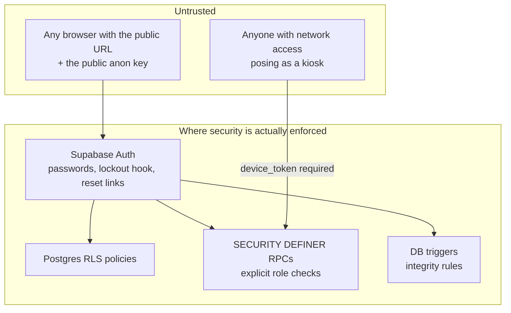

# PTL Timesheet — Security Testing & Posture

How security is tested on PTL Timesheet (and the shared database it
operates with PTL Clock), what has been found and fixed, the controls
currently in place, and the honest list of what is *not* yet covered.

This document describes real, performed activity — nothing here claims a
test that didn't happen. Where a control is partial or advisory, it says
so.

---

## 1. Scope and threat model

**In scope:** the PTL Timesheet web app, the shared Supabase project
(Postgres, Auth, RPCs, RLS), the Cloudflare Worker (assets, `/config.json`,
Xero OAuth routes), and the database surface the PTL Clock kiosk calls.
The kiosk device/app itself is owned and tested by the PTL Clock side.

**Trust boundaries** (everything below the browser line is untrusted):



The governing principle, verified repeatedly in testing: **the UI is not a
security control.** Anyone can call PostgREST directly with the public
anon key, so every protection must hold at the database — RLS for row
access, explicit auth checks inside every `SECURITY DEFINER` function,
and triggers for integrity rules (e.g. department-required-on-submit,
migration 148).

**Assets we protect:** employee PII (names, emails, rates), payroll data
(hours, leave, overtime), org secrets (SMTP credentials, webhook keys,
Xero tokens), and the integrity of clock events (they drive pay).

## 2. How security is tested

There is no automated security test suite; testing is **manual and
code-audit driven**, in four forms:

1. **Security audit of the database surface.** A systematic review of
   every RPC and RLS policy, with particular attention to functions
   callable by `anon` (pre-login) and to `SECURITY DEFINER` functions
   (which bypass RLS and must do their own checks). This audit produced
   the graded findings in §3 (C=critical, H=high, M=medium, L=low), each
   remediated in a numbered migration whose header documents the finding
   verbatim — the migration history doubles as the audit log.
2. **Role-matrix access testing.** Exercising the app as each role
   (employee, manager, admin, developer, clock-viewer) and confirming
   both the UI scope *and* the underlying data scope: what a manager's
   RPC calls return for someone outside their team, whether an employee
   can action another employee's leave, whether a non-admin can reach
   admin RPCs. New role-crossing features (approve-on-behalf,
   request-on-behalf, team change requests) are tested this way before
   release.
3. **Auth-flow testing.** Sign-in, temp-password provisioning, forced
   password change, lockout behaviour, password reset end-to-end
   (including the redirect allow-list, which testing found misconfigured
   — see §3), and the Xero OAuth round-trip.
4. **Incident-driven verification.** When something breaks in a way that
   touches trust (e.g. the shared-function overload incident), the fix
   ships with a verification query the operator runs against the live
   database, and the class of failure is written into the developer
   guide's rules.

Verification of applied database changes is itself testable: because
migrations are hand-applied, we probe the live catalog
(`pg_proc` / `pg_trigger` / `pg_get_functiondef`) to confirm which
security fixes are actually active, not just present in the repo.

## 3. Audit findings and remediations

Findings from the database-surface security audit, in severity order.
All are remediated; the migration column is the authoritative record.

| ID | Severity | Finding | Remediation | Fixed in |
|----|-------|--------------------|--------------------|-----|
| C1 | Critical | `organisations` SELECT policy was `using (true)` — any authenticated user could read every org's plaintext SMTP password and jobs/tasks/dept-codes webhook keys; a stolen webhook key let a regular employee overwrite org data via the anon ingest RPCs | Secrets moved to a dedicated `org_secrets` table readable only by org admins (service_role for edge functions); old columns nulled so lingering readers get NULL, not data. All exposed SMTP passwords and webhook keys rotated and treated as disclosed | 141 |
| H1 | High | Provisioning and admin resets set the literal shared password `PASSWORD`, and the forced-change flag was enforced client-side only — fresh accounts were takeover-able via direct `/auth/v1/token` calls before first login | Random 12-character one-time password per user, returned once to the admin for out-of-band delivery; no shared credential exists to pre-authenticate with | 140 |
| M3 | Medium | `record_login_attempt` was anon-callable and trusted a client-supplied success flag and arbitrary email — attackers could pollute forensics with fake successes or forge failures against a victim | Anon endpoint records failures only; successes recorded by a separate authenticated RPC that derives the email from `auth.uid()` | 139 |
| H1/M3 | Follow-up | The account lockout was advisory (checked client-side), so direct token-endpoint calls bypassed it | A Supabase *Password Verification Attempt* auth hook makes the auth server itself the recorder of attempts and **rejects sign-in when locked** (5 failures / 15 min), closing the bypass. Requires one-time enabling in the dashboard (Authentication → Hooks) | 142 |
| L5 | Low | The Xero OAuth `state` token carried a nonce that was never checked — a captured state was replayable for its 600-second TTL | Callback burns each nonce on first use (`xero_oauth_used_states`, service_role only); replays rejected | 143 |

### August 2026 audit

A second full pass — see [SECURITY-AUDIT-2026-08.md](SECURITY-AUDIT-2026-08.md)
for the detail, evidence and verification steps. Summary:

| ID | Severity | Finding | Remediation | Fixed in |
|----|-------|--------------------|--------------------|-----|
| A1 | High | Every HTTP security header (CSP, HSTS, X-Frame-Options, nosniff, Referrer-Policy, Permissions-Policy) was absent in production. `run_worker_first` is off, so Cloudflare's asset layer served every page and script without invoking the Worker — `addSecurityHeaders()` only ever ran on the SPA-fallback path. The app was framable; the CSP that the code and docs described had never been sent. The edge geo-block was inert for the same reason | Headers moved to `public/_headers`, which the asset layer applies. Worker copy kept for the fallback path | `public/_headers` |
| A2 | High | `org_live_status` and `_offsite_report` are `SECURITY DEFINER`, granted to `authenticated`, take a caller-supplied `p_org_id` and had **no authorisation check** — any signed-in employee could read every employee's live status and off-site history, in their own org and in every other org in the shared project | Implementations renamed and gated wrappers put at the original names, mirroring `weekly_timesheet` / `_timesheet_rows`. No client change in either app | 159 |
| A3 | Medium | `login_attempts` had no writer at all: 139/142 moved recording to the auth hook, `signin.js` stopped recording, and the hook is Team/Enterprise-only and was never enabled. No lockout and no failed-login forensics | Attempts recorded again and tagged by provenance; audit trail restored on the current plan | 162 |
| A4 | Medium | Department-lead read policies were organisation-wide despite their names — a lead received every employee's `cost_rate`/`sell_rate` and every timesheet in the org on each `/department.html` load | All three read policies re-keyed on `user_manages_target_user`, matching the write policies from 118 | 160 |
| A5 | Medium | Anon lockout-poisoning: `record_login_attempt` is anon-callable and keyed on a client-supplied email, so restoring client-side recording would have let anyone lock any employee out | Lockout now counts only `source = 'auth_hook'` rows; anon-written rows are forensics only | 162 |
| A6 | Low | `organisations` SELECT still `using (true)` — cross-tenant read of org settings, and the same shape that produced C1 | Scoped to org admins or members | 161 |
| A7 | Low | CSP allows `https://esm.sh`, which serves any npm package — close to `script-src *` for an attacker with an HTML-injection foothold | Open. Vendoring `xlsx`/`jspdf` would let `esm.sh` come out of `script-src` and `connect-src` | — |
| A8 | Low | `must_change_password` enforced only on the sign-in path | Enforced in `getUserContext()`, so it covers every page | `shared.js` |
| A9 | Low | `provision_employee_login` linked an existing auth identity by email match without checking whether another employee row already owned it | Refuses the link; unique index on `users.auth_user_id` where the data allows | 163 |

Additional issues found and fixed outside the graded audit:

- **Password-reset links were dead on arrival** — Supabase's Site URL was
  still `http://localhost:3000` with an empty redirect allow-list, so
  every emailed link bounced to localhost. Fixed in configuration (real
  origin + wildcard allow-list); the client also now forwards a recovery
  token to the reset page from wherever it lands, and surfaces the real
  error (e.g. a link consumed by a corporate email scanner) instead of a
  generic failure.
- **Payroll-integrity rule bypassable on behalf** — submit-on-behalf could
  skip the department-code requirement; now enforced by a DB trigger so
  no client path can bypass it (migration 148).

## 4. Standing controls (what testing verifies stays true)

**Authentication.** Email + password via Supabase Auth; Cloudflare
Turnstile CAPTCHA on the auth forms; random per-user temp passwords with
a forced change on first login; binding server-side lockout via the
auth hook (142); single-use, expiring password-reset links.

**Authorization.** RLS on app tables; `SECURITY DEFINER` RPCs re-check
the caller (`is_admin_of`, `user_manages_target_user`, or row-ownership
via `auth.uid()`) before acting — approval, on-behalf, and report
functions gate server-side. Client checks exist only for UX.

> This is the rule, not an automatically-guaranteed property. The August
> 2026 audit found two shared clock RPCs that had shipped without any
> check at all (A2, fixed in 159) — reachable by any signed-in user for
> any organisation, with a code comment in `timeclock.js` noting that the
> permission was "app-side via the topbar nav". Treat an ungated
> `SECURITY DEFINER` function as a live finding, not a style issue, and
> check EXECUTE grants as well as function bodies: a function is only
> private if it is actually revoked from `public`/`authenticated`.

**Kiosk write path** (PTL Clock's functions, same database): every call
requires a registered `device_token`; scans are rate-limited by a
per-user cooldown; timestamps are clamped (future → now, >48h old →
rejected); replayed events older than the user's newest event are
refused (`stale_replay`) so history can't be rewritten out of order.

**Secrets.** Org secrets live in the admin-only `org_secrets` table;
Worker secrets (service-role key, Xero credentials) are Cloudflare
secrets, never in the repo; the Supabase URL and anon key are public by
design (safety rests on RLS/RPC checks, per the trust model above). The
service-role key is used only by the Worker's Xero routes against a
table locked to service_role.

**Web client.** All dynamic HTML goes through `escapeHtml()` (template
literals, attribute-safe escaping); no `innerHTML` of raw user input;
OAuth state tokens are signed and single-use; assets served with
`no-cache` so security fixes take effect on next load rather than
lingering in caches. Security headers — CSP (no `'unsafe-inline'` in
`script-src`), HSTS, `X-Frame-Options: DENY`, `nosniff`, Referrer-Policy,
Permissions-Policy — are set in `public/_headers`, **not** in `worker.js`:
static assets bypass the Worker entirely. Verify with
`curl -I https://<domain>/signin.html`, not by reading `worker.js`.

**Payroll integrity.** Quarter-hour snapping, the department-required
trigger, status-transition guards in the leave RPCs (a request can only
be approved from a pending state, only by an authorised reviewer), and
clock-adjustment changes only via reviewed requests.

## 5. Security testing checklist for new changes

Run through this before shipping anything that touches data access:

1. **New/changed RPC:** does it check the caller's authority *inside the
   function*? Test it as the wrong role via a direct `rpc()` call, not
   just through the UI.
2. **EXECUTE grants, not just bodies.** A helper is only private if it is
   revoked — Postgres grants EXECUTE to `PUBLIC` by default, and an
   underscore prefix means nothing to PostgREST. Audit A2 was exactly
   this: `_offsite_report` looked internal and was granted to
   `authenticated`. For anything new, run:
   ```sql
   select p.proname, p.prosecdef, array(select unnest(p.proacl)::text) as acl
     from pg_proc p join pg_namespace n on n.oid = p.pronamespace
    where n.nspname = 'public' and p.proname = '<fn>';
   ```
3. **Headers are a deploy-time property.** After any change to
   `public/_headers`, `wrangler.toml` or `worker.js`, confirm with
   `curl -I https://<domain>/signin.html` that the CSP and friends are
   actually present. Reading the source is not verification (audit A1).
4. **New table/column:** what do RLS policies allow for each role? Probe
   with selects as a non-privileged user. Never ship a `using (true)`
   policy on anything containing secrets or other users' data (see C1).
   Check the policy's *scope* matches its *name* — A4 was three policies
   named for department scope that were organisation-wide.
5. **Cross-user features** (on-behalf, approvals): test the two failure
   directions — acting on someone outside your scope, and a target user
   actioning a request that isn't theirs.
6. **Anything rendered from user input:** confirm it passes through
   `escapeHtml()`; try a `<script>`/quote payload in the field.
7. **Shared functions:** snapshot the live definition first
   (`pg_get_functiondef`) — never edit from a stale copy; confirm
   ownership (kiosk write path belongs to PTL Clock). `org_live_status`
   and `_offsite_report` are now gated **wrappers** (159) over
   `*_impl` functions — edit the `_impl`, never the wrapper, and never
   `create or replace` the wrapper name from the Clock side or the gate
   is silently lost.
8. **After applying a security migration:** verify it's live with a
   catalog probe, and check the migration's header for required
   follow-ups (e.g. 141 required rotating disclosed keys; 142 requires
   the dashboard hook to be enabled; 159 requires coordinating with the
   PTL Clock repo).

## 6. Known limitations and recommended next steps

Stated plainly so nobody mistakes the current posture for more than it
is:

- **No automated security regression tests** — the checklist above is
  manual. A small pgTAP or scripted role-matrix suite over the RPCs
  would catch regressions mechanically.
- **No independent penetration test has been performed** — testing to
  date is internal audit + manual verification. A third-party test is
  the natural next step if the app's exposure grows.
- **Clock-viewer department scoping is a display scope, not RLS**
  (migration 144 says so explicitly) — trusted internal managers only;
  promote to an RLS boundary if that trust assumption changes. Note the
  *page-level* permission is now a real boundary: before migration 159 it
  too was app-side only, and any signed-in user could call the underlying
  clock RPCs directly for any organisation (audit A2). What remains a
  display scope is only which departments a legitimate viewer sees.
- **There is no account lockout, and the 142 auth hook cannot be enabled
  on the current Supabase plan** — the *Password Verification Attempt*
  hook is Team/Enterprise-only. Be precise about the state after
  migration 162: failed sign-ins are recorded again and the forensic
  trail works, but rows written from the browser are tagged
  `source = 'client'` and the lockout counts only `source = 'auth_hook'`
  rows. Since nothing writes those, **the lockout never fires**. That is
  deliberate — the anon recording endpoint is keyed on a client-supplied
  email, so letting it drive the lockout would let anyone lock out any
  employee (audit A5). If the plan is ever upgraded, enabling the hook
  makes the lockout binding with no code change.

  What actually stands between an attacker and password guessing:
  Supabase's per-IP rate limiting on the auth endpoints, the 8-character
  minimum, and — **the primary control, and the one to switch on** —
  Cloudflare Turnstile CAPTCHA enforcement in Supabase → Authentication →
  Attack Protection. It applies to direct `/auth/v1/token` calls too,
  needs no plan upgrade, and the client plumbing (`js/turnstile.js`, site
  key in `wrangler.toml`, `captchaToken` passed to `signInWithPassword`)
  is already in place. Until it is enabled, treat brute-force resistance
  as per-IP rate limiting only.
- **Supply chain:** supabase-js is vendored (good), but export/QR
  libraries are lazy-loaded from esm.sh at pinned versions; vendoring
  them too would remove the remaining third-party runtime dependency.
- **The CSP allows `https://esm.sh` in `script-src`** (audit A7). A CSP
  *is* now served (see §4), and it refuses `'unsafe-inline'` — but
  `esm.sh` will serve any npm package, so an attacker with an
  HTML-injection foothold could still load script from it. Vendoring
  `xlsx` and `jspdf` the way `supabase-js` already is would let `esm.sh`
  come out of both `script-src` and `connect-src` and make the policy
  genuinely restrictive. Until then `escapeHtml` discipline remains the
  primary XSS defence and the CSP is a partial second layer.
- **Security headers live in `public/_headers`, and that is load-bearing.**
  Anything that moves them back into `worker.js` alone silently disables
  them for every real page (audit A1). This is not detectable by reading
  the Worker source — only by requesting a page.
- **Shared-database coordination is procedural** — the ownership rules
  in the developer guide prevent a repeat of the function-clobbering
  incidents only if followed; there is no technical guard.
