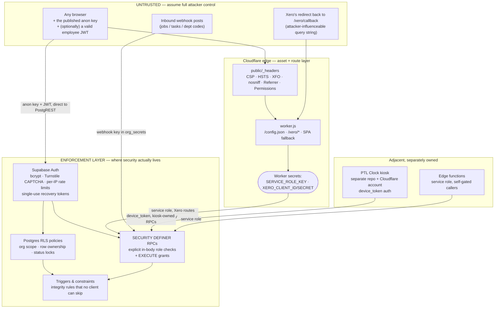

# PTL Timesheet — Security Posture

The canonical security document for the PTL Timesheet module (repo codename
*Timeium*, Cloudflare Worker `temporium`). It describes how the system is
built to resist misuse, what has been found and fixed across two audit
passes, how those controls are verified, and — explicitly — what is not
covered.

Every control described here is traceable to a migration number, a file
path or a policy name. Nothing in this document asserts a test, a
certification or an assessment that did not happen. Where a control is
partial, advisory, or dependent on an operator action, it says so in the
same breath as the claim.

---

## 1. Document control

| | |
|---|---|
| **Version** | 1.0 |
| **Date** | 2026-08-05 |
| **Owner** | Ethan Brown (GitHub [`ethanbrown7619-eng`](https://github.com/ethanbrown7619-eng)) |
| **Applies to** | `ethanbrown7619-eng/Timeium` — the PTL Timesheet web app, its Cloudflare Worker (`temporium`), the Supabase surface it uses, its two edge functions, and the Xero Payroll NZ integration |
| **Generated from** | Migrations up to and including `163`; front-end at `public/` as of 2026-08-05 |
| **Companion documents** | [SECURITY-TESTING.md](SECURITY-TESTING.md) (methodology and standing posture) · [SECURITY-AUDIT-2026-08.md](SECURITY-AUDIT-2026-08.md) (the August 2026 audit in full) · [RPC-REFERENCE.md](RPC-REFERENCE.md) (the authorization surface) · [DEVELOPER-GUIDE.md](DEVELOPER-GUIDE.md) Part VI (security & privacy conventions) |
| **Review cadence** | Reviewed on every change to an RLS policy, a `SECURITY DEFINER` function, an authentication flow, `public/_headers`, `worker.js` or an edge function; and in any case at least every six months. Bump the version and date in the same commit as the change. |

**Scope statement.** In scope: the PTL Timesheet web application; the
Cloudflare Worker that serves it (static assets, `/config.json`, the
`/xero/*` OAuth and proxy routes); the Supabase Postgres database surface
this module uses (tables, RLS policies, `SECURITY DEFINER` RPCs, triggers)
and Supabase Auth; the `send-timesheet-notifications` and
`sync-infusion-projects` edge functions; and the Xero Payroll NZ OAuth
integration.

Out of scope but documented as a **trust boundary** (§3.4): the PTL Clock
kiosk application, which is a separate repository on a separate GitHub and
Cloudflare account and shares the same Supabase project. Its device-token
authentication, kiosk hardware and physical siting are owned and assessed
by that side. This document does not claim the kiosk's controls as its own.

---

## 2. Executive summary

PTL Timesheet is a browser application with no server of its own. The
pages are static files; the browser talks to a hosted Postgres database
(Supabase) directly, using a public API key that is deliberately published.
That design only holds together because of one governing principle, applied
without exception:

> **The user interface is not a security control. Every protection is
> enforced at the database.**

Anyone can open the browser's developer tools, take the public key, and
issue their own requests against the database — bypassing every button,
every hidden tab, and every client-side check the application makes. So
the application is built on the assumption that they will. Access to rows
is governed by Postgres Row-Level Security policies that run inside the
database engine; anything that crosses a user boundary (approving someone
else's timesheet, reading a team's leave, provisioning a login) runs inside
a database function that re-checks the caller's authority in its own body
before doing anything.

The practical consequences for a reader assessing risk:

- **An unauthenticated person on the internet** can retrieve the sign-in
  page and the public configuration. They cannot read a single row of
  employee data. The only functions callable without a session are a
  failure-logging endpoint and a lockout status check, both count-only
  (§6.4).
- **An authenticated employee** who abandons the UI and calls the database
  directly still sees only their own timesheets, their own leave, their own
  clock events, and the reference data their organisation shares (jobs,
  departments, leave types). They cannot read a colleague's pay rate, edit
  a timesheet they have already submitted, or approve their own leave —
  each of those is refused by a specific, named policy (§10).
- **A department lead** sees the employees whose department they actually
  manage — not, since migration 160, the whole organisation.
- **Payroll-affecting data is locked once it is signed off.** An employee
  cannot alter a submitted or approved timesheet by any route, because the
  restriction is a database policy rather than a hidden button (migration
  054).
- **Secrets never reach the browser.** SMTP credentials, webhook keys and
  Xero tokens live in server-side-only stores; the key that could bypass
  all of the above exists solely as a Cloudflare Worker secret used by the
  Xero routes.

The system has been through two graded security audit passes. The first
(five findings, C1/H1/M3/L5 plus a follow-up) closed a critical
cross-tenant secret exposure and a credential-provisioning weakness. The
second, in August 2026 (nine findings, A1–A9), found that an entire class
of HTTP security headers documented as enforced was in fact never being
sent, and that two shared reporting functions were callable by any signed-in
employee for any organisation. Both were fixed, along with six of the
remaining seven findings. Every finding, its remediation, and the migration
that carries it is recorded in §11 — and in the migration headers
themselves, so the database's own change history doubles as an audit log.

The honest list of what is **not** covered — no automated security
regression suite, no independent third-party penetration test, no binding
account lockout on the current Supabase plan, and a permissive CDN entry
still in the content-security policy — is §15. It is not an appendix. It
is the part that makes the rest of this document worth trusting.

---

## 3. System architecture and trust boundaries

### 3.1 Shape of the system

There is no application server. The architecture is deliberately thin:

- **`public/`** — plain HTML pages and vanilla ES modules. No framework,
  no bundler, no build step (`docs/DEVELOPER-GUIDE.md` §1). Each page loads
  exactly one module plus `js/shared.js`.
- **Cloudflare Worker `temporium`** (`worker.js`) — serves the static
  assets binding, synthesises `/config.json`, and hosts the `/xero/*`
  routes. It is the **only** component that holds a privileged key.
- **Supabase** — Postgres with PostgREST in front of it, plus Supabase
  Auth. The browser speaks to it directly using the public anon key and the
  signed-in user's JWT.
- **Two edge functions** — `send-timesheet-notifications` (SMTP digests,
  reminders, leave notifications) and `sync-infusion-projects` (project
  import), both Deno functions running with the service role and gating
  their own callers.

### 3.2 Trust boundary diagram



Everything above the enforcement layer is untrusted. The dashed conceptual
line is not the Worker and not the page — it is the boundary of the
Postgres process.

### 3.3 Why publishing the anon key is safe

`wrangler.toml` commits `SUPABASE_URL` and `SUPABASE_ANON_KEY` as plain
`[vars]` (`wrangler.toml:38-40`), and `worker.js` serves both to any caller
at `/config.json` (`worker.js:42-74`). This is intentional and safe for a
specific, checkable reason.

The anon key is not a credential in the ordinary sense. It is a signed JWT
whose only claim is `"role": "anon"`. Presenting it tells Postgres to run
the request as the `anon` database role — the *least*-privileged role in
the system. It confers no identity and no row access on its own. Row access
comes from the second token, the user's session JWT, which carries
`auth.uid()`, and from what the RLS policies and function bodies decide to
do with that value.

So the security question is never "who has the anon key?" — everyone does,
by design — but "what can the `anon` role reach?". Concretely:

- Application tables have RLS enabled and no policies granting `anon` any
  read. `public.org_secrets` explicitly revokes all from `anon`
  (`141_org_secrets.sql:65`); `public.xero_connections` denies everything to
  `authenticated` outright (`112_xero_connections.sql:51-56`);
  `public.xero_oauth_used_states` revokes from both `anon` and
  `authenticated` (`143_xero_oauth_used_states.sql:19-20`);
  `public.leave_notification_queue` is RLS-on with **no policies at all**
  and revoked from both client roles (`158_leave_email_notifications.sql:81-82`).
- Exactly two functions are granted to `anon`:
  `record_login_attempt(text,text,text)` and `check_login_locked(text)`
  (`162_restore_login_audit_trail.sql:141,186`). Both are analysed in §5.6.
- Everything else requires a session, and having a session gets you only
  what the policies in §6 allow.

The same reasoning applies to the Turnstile **site** key
(`wrangler.toml:45`) — it is the public half of the CAPTCHA pair; the
secret half lives in Supabase's Auth configuration and never leaves it
(`docs/DEVELOPER-GUIDE.md`, environment-variable table).

The corollary is the discipline this document exists to demonstrate: since
the key is public, *any* gap in RLS or in a `SECURITY DEFINER` body is
directly internet-reachable by anyone with a valid employee login. Audit
finding A2 (§11) is exactly what that looks like when the discipline slips.

### 3.4 The shared-database trust boundary: PTL Clock

The Supabase project `kyfydyownbgwhquorchn` is shared. PTL Timesheet and
the PTL Clock kiosk are two applications, two repositories, two GitHub
accounts and two Cloudflare accounts, on **one** database. (ERP sibling
modules also share the project.)

The boundary is therefore **not** a network boundary and **not** a schema
boundary. It is a boundary of *ownership and authorship*, enforced by three
mechanisms, two procedural and one technical:

1. **Migration-number partition** (procedural). This repo owns numbers
   ≤ 199; the kiosk owns 200+. `docs/DEVELOPER-GUIDE.md` §"Migration
   numbering" states the rule; the `supabase/migrations/` folder is the
   registry, and numbers are taken first-come.
2. **Function ownership split** (procedural, documented in
   `docs/DEVELOPER-GUIDE.md` §5 and enumerated function-by-function in
   `docs/RPC-REFERENCE.md`):

   | Owner | Functions |
   |---|---|
   | **PTL Clock** | The kiosk *write* path — `record_scan`, `record_offsite_choice`, `admin_add_clock_event`, the auto-close family, device pairing (`create_pairing_code`, `redeem_pairing_code`, `list_devices`, `revoke_device`) |
   | **PTL Timesheet** | The *read/report* functions — `org_live_status`, `_offsite_report`, `_timesheet_rows` — even though PTL Clock's admin page also consumes them |

3. **Gated wrappers over renamed implementations** (technical). Migration
   159 converted `org_live_status` and `_offsite_report` into thin gated
   wrappers delegating to `_org_live_status_impl` / `_offsite_report_impl`,
   with the implementations revoked from `public`, `anon` and
   `authenticated` (`159_gate_clock_report_rpcs.sql:136-138, 228-230`). A
   Clock-side `create or replace` on the public name would overwrite the
   wrapper, so 159 is written to be **re-runnable as a true repair**: it
   detects whether the public name holds its own wrapper (by a
   `[159-gate-wrapper]` marker token in the body) or a fresh implementation,
   and in the latter case moves the *new* Clock body into `*_impl` and
   rebuilds the gate over it — preserving the Clock change rather than
   reverting it (`159:100-125, 195-219`). The same file has been copied into
   the PTL Clock repository as `210_gate_clock_report_rpcs.sql`, whose header
   states it is byte-identical to 159 and records finding A2, so the gate is
   documented in both histories rather than in one.

**What this module does *not* claim.** The kiosk write path — device-token
registration, per-user scan cooldowns, timestamp clamping (future → now,
>48h old → rejected), and `stale_replay` rejection of out-of-order events —
is PTL Clock's control set, tested by PTL Clock. It is described in
`SECURITY-TESTING.md` §4 as context, and it is relevant to the integrity of
the clock data this module *reads*, but it is not evidence of this module's
security engineering and is not presented as such here.

**Residual risk, stated plainly.** Two of the three mechanisms are
procedural. There is no technical guard preventing the other repository
from clobbering a shared function; mechanism 3 makes the damage detectable
and repairable, not impossible. See §15.

---

## 4. Threat model

### 4.1 Assets

| Asset | Where it lives | Why it matters |
|---|---|---|
| Employee PII | `public.users` — name, email, employee code, employment type, department | Identified personal information under the NZ Privacy Act 2020 |
| Pay rates | `public.users.cost_rate`, `public.users.sell_rate` | Commercially and personally sensitive; the target of audit finding A4 |
| Payroll hours | `public.timesheets`, `public.timesheet_entries` (seven hour columns per row) | Drives pay. Integrity matters as much as confidentiality |
| Leave records | `public.leave_requests`, `public.leave_balances`, `public.leave_transactions` | Includes sick leave — health-adjacent information |
| Clock history | `public.clock_events`, `public.status_events` (kiosk-written) | Drives the clock-vs-timesheet comparison, and therefore pay disputes |
| Organisation secrets | `public.org_secrets` — SMTP credentials, three webhook API keys | Compromise enables mail relay and unauthenticated data overwrite |
| Xero OAuth tokens | `public.xero_connections` — access + rotating refresh tokens | Access to the payroll system itself |
| The service-role key | Cloudflare Worker secret | Bypasses RLS entirely — equivalent to every row in a shared database |
| Audit trails | `public.login_attempts`, `public.infusion_export_logs` | Forensic value; their absence was itself a finding (A3) |

### 4.2 Actors and what each is prevented from doing

**Unauthenticated internet.** Has the app URL, the anon key, the Turnstile
site key, and the full source of every front-end module (it is unminified
and served as-is). *Prevented from:* reading any application row —
no table grants an `anon` read policy; calling any RPC other than
`record_login_attempt` and `check_login_locked`; enumerating whether an
email address has an account (the forgot-password flow always advances to
the code step and says "if an account exists…", `public/js/forgot-password.js:34-37`);
brute-forcing a password without solving a CAPTCHA (§5.3) and within
Supabase's per-IP auth rate limits; locking a victim out by flooding the
anon failure endpoint (migration 162 excludes client-sourced rows from the
lockout count — §5.6); framing the app to harvest clicks
(`frame-ancestors 'none'` + `X-Frame-Options: DENY`, `public/_headers:20,24`).

**Authenticated employee** — the most important actor, because this is the
attacker with a legitimate credential who then discards the UI.
*Prevented from:* reading another employee's timesheet, entries, or leave
(`users select own timesheets`, `users select own entries`,
`employees select own leave_requests`, all keyed on
`u.auth_user_id = auth.uid()`, migration 054); reading another employee's
pay rate (`public.users` SELECT policies are own-row, admin,
clock-viewer, or department-manages-target — migration 160); editing a
timesheet once submitted (`users update own unlocked timesheets` restricts
the pre-state to `draft`/`rejected`, `054:163-181`); self-approving leave
(the employee UPDATE policy permits only `pending → pending|cancelled`,
`054:311-329`, and approval is an RPC gated on admin-or-manages-target,
`150:151-153`); submitting a timesheet with unclassified hours (trigger
`trg_timesheet_require_department`, migration 148); reading any other
organisation's live clock status or off-site history (migration 159);
reading other organisations' settings rows (migration 161); reaching
`org_secrets`, `xero_connections`, `xero_oauth_used_states` or
`leave_notification_queue` at all.

**Department lead** (`users.is_manager = true` plus
`departments.manager_id`). *Prevented from:* reading users, timesheets or
entries outside the departments they actually manage — since migration 160
all three read policies are keyed on `user_manages_target_user()`, matching
the write policies migration 118 already used; editing outside that scope
(write policies were already correctly scoped); reading pay rates for
anyone but their own direct reports (accepted residual — see §7 and §15);
approving leave for someone they do not manage (`150:151-153`).

**Org manager / admin.** Genuinely org-wide by design.
`is_admin_of(org)` returns true for any `admins` row matching the
organisation regardless of role, plus any `role = 'developer'` row against
any organisation (`schema-replica.sql:283-286`). *Prevented from:* reaching
another organisation's data — every admin-scoped policy and every
`resolve_org_id()` call pins the organisation, and `resolve_org_id` raises
`org override not permitted` when a non-developer passes a foreign id
(`schema-replica.sql:311-313`); reading raw Xero tokens (RLS `using (false)`
for `authenticated`, `112:51-56`; `xero_connection_status` deliberately
omits the token columns, `112:64-71`); reading `smtp_pass` back out
(`get_org_secrets_admin` returns every secret column *except* the password —
write-only by construction, `141:81-97`); silently binding a foreign auth
identity to a local employee row (migration 163); seeing the Infusion export
audit trail, which is developer-only (`124:33-37`).

**Compromised admin account** — assume the credential is stolen. This is
the actor with the least residual protection, and the document says so.
They can read and modify their organisation's data. *Still prevented from:*
reading the raw Xero tokens or SMTP password (above); reaching another
organisation; escalating to `developer` (`developers manage admins` is
`using (is_developer())`, `schema-replica.sql:1545`); acting without a
trace on exports (`infusion_export_logs`) or logins (`login_attempts`,
provenance-tagged). *Detection, not prevention,* is the honest control
here.

**Cross-tenant attacker** — an authenticated user of organisation A
attempting to reach organisation B in the shared project. This is the
threat that produced the two most serious findings in the system's history
(C1 and A2). *Prevented from:* reading org B's settings (161); reading org
B's live clock status or off-site report (159); reading org B's secrets
(141); passing a foreign `p_org_id` into any RPC that resolves the
organisation server-side (`resolve_org_id`, and the explicit `p_org_id`
pinning in the 159/160 gates).

### 4.3 Threats explicitly out of model

- Compromise of the Supabase platform, of Cloudflare, or of the underlying
  hosts.
- Physical access to the kiosk hardware (PTL Clock's scope).
- Insider misuse by the holder of the service-role key or the Supabase
  dashboard — that person can read and alter everything, and the control is
  organisational (access is held by the owner alone,
  `docs/DEVELOPER-GUIDE.md` Part VI), not technical.
- Denial of service beyond what Cloudflare and Supabase's own rate limiting
  provide.

---

## 5. Authentication

### 5.1 Identity provider

Identity is Supabase Auth: email plus password, bcrypt-hashed in
`auth.users`. The application never implements its own password comparison.
Two application tables attach meaning to an identity:

- `public.users` — the employee row, keyed by `auth_user_id`. This is what
  RLS policies join against (`auth_user_id = auth.uid()`).
- `public.admins` — role per organisation (`admin` / `manager` /
  `developer`), keyed by the auth UUID directly.

The two key spaces are deliberately different — `admins.user_id` is an auth
UUID, `users.id` is a bigint employee id — and both appear in authorization
checks (`docs/RPC-REFERENCE.md`, "Notes for maintainers" §3). Getting this
wrong is a recurring source of subtle policy bugs, which is why the
reference document states it explicitly.

First-login linkage is handled by `claim_employee_by_email()` (migration
024), which uses `auth.uid()` and links **only** an unclaimed `users` row
whose email equals the authenticated email — it cannot be pointed at
someone else's row.

### 5.2 Password policy

- Minimum length **8 characters**, applied at every password-setting
  surface: `MIN_PASSWORD_LENGTH` and `validatePassword()`
  (`public/js/shared.js:424-431`), and `minlength="8"` on the inputs in
  `change-password.html:32,36`, `reset-password.html:38,42`,
  `settings.html:57,61` and `signup.html:41`.
- Hashing is bcrypt via `crypt(..., gen_salt('bf'))` where the application
  sets a password directly — `provision_employee_login` (`163:77`) and
  `reset_employee_password` (`140:86`) — and Supabase Auth's own bcrypt
  otherwise.

Be precise about what this is: the 8-character floor is enforced in the
browser and in Supabase Auth's own minimum-length setting. The browser
check is a usability control, not a boundary; the authoritative minimum is
the dashboard setting. A user determined to set a weak password by calling
the auth API directly is bounded by that setting, not by
`validatePassword()`. There is no complexity requirement, no password
history and no breach-corpus check.

### 5.3 CAPTCHA — Cloudflare Turnstile

Turnstile CAPTCHA enforcement is **enabled** in Supabase →
Authentication → Attack Protection. This is the primary brute-force
control on this deployment.

Enforcement is server-side: Supabase Auth verifies the token against the
Turnstile secret key (held in Supabase Auth's settings, never in this repo)
before performing the password check. Critically, that verification applies
to **direct calls to `/auth/v1/token`**, not only to submissions from the
application's own form — which is precisely the bypass that a client-side
control cannot close.

The client plumbing:

- `public/js/turnstile.js` — `mountTurnstile(container)` loads
  `https://challenges.cloudflare.com/turnstile/v0/api.js?render=explicit`,
  renders the widget explicitly, and returns `{ getToken, reset }`. The
  token getter polls for up to 8 seconds for a token that Managed mode
  usually settles in under two (`turnstile.js:58-66`), and `reset()` is
  called after a failed attempt so the next try does not reuse a spent
  token.
- The site key reaches the browser through `/config.json`
  (`worker.js:65`), sourced from `wrangler.toml:45`. It is public by
  design and annotated as such in both files.
- Three auth surfaces mount and pass a token:
  sign-in (`public/js/signin.js:6,48-51`), sign-up
  (`public/js/signup.js:6,24-26`) and forgot-password
  (`public/js/forgot-password.js:6,23-24`, passed to
  `resetPasswordForEmail`).

`reset-password.html` does not mount a widget, correctly: by the time a
user reaches it they already hold a Supabase recovery session, so there is
no unauthenticated credential guess to protect.

`mountTurnstile` degrades gracefully if no site key is configured —
`getToken()` returns `null` and the page still submits (`turnstile.js:43-47`).
With enforcement on, a missing token is rejected by Supabase and the user
sees the auth error. That is the intended failure mode: fail closed at the
server, not at the widget.

### 5.4 Provisioned credentials — random, one-time, out-of-band

Before migration 140, both provisioning and admin-initiated resets set the
literal shared password `PASSWORD`, and the forced-change flag was checked
only by the sign-in page. Any freshly provisioned account was takeover-able
by anyone who knew the convention, by authenticating directly against
`/auth/v1/token` before the employee ever logged in. That was graded H1
(§11).

Now:

- `gen_temp_password()` returns a 12-character value derived from 9 bytes
  of `gen_random_bytes`, base64-encoded with the three base64 specials
  translated to letters so it can be dictated over the phone
  (`140:22-27`). It is `revoke all ... from public` (`140:29`).
- `provision_employee_login(p_user_id)` returns that password **once**, to
  the calling admin, for out-of-band delivery — and returns `null` when it
  linked an existing auth identity rather than creating one
  (`163:38-86`). It requires `is_admin_of(employee's org)` (`163:48`).
- `reset_employee_password(p_user_id)` does the same for an existing
  account, also admin-gated (`140:73-90`).
- Both set `must_change_password = true`.

The key property is negative: **there is no shared credential in the
system to pre-authenticate with.**

### 5.5 Forced password change, enforced app-wide

Migration 140's header recommended server-side enforcement of
`must_change_password` as a defence-in-depth follow-up; the August 2026
audit recorded the gap as A8. It is now enforced in `getUserContext()`
rather than only on the sign-in path:

```js
// public/js/shared.js:842-847
function enforceMustChangePassword(data) {
  if (!data?.mustChangePassword) return data;
  if (MUST_CHANGE_ALLOWED_PATHS.has(location.pathname)) return data;
  location.replace(PASSWORD_CHANGE_PATH);
  throw new Error("password change required");
}
```

`getUserContext()` calls it on both the cache-hit and the fresh-fetch paths
(`shared.js:863, 872`), so it applies on every page that resolves a user
context — which is every page (`docs/DEVELOPER-GUIDE.md` §2, "modules start
with top-level `await` (session → `getUserContext` → `renderTopbar`)"). The
allow-list is exactly the four pages a user in this state legitimately
needs: the change-password page itself, sign-in, forgot-password and
reset-password (`shared.js:835-840`). The flag is cleared by
`clear_must_change_password()`, which updates only the caller's own row
(migration 111).

**Stated precisely:** this is a client-side control and the comment in the
source says so (`shared.js:830-833`). It is not a boundary — a user could
call the database directly and skip it. It does not need to be a boundary,
because migration 140 removed the attacker-known credential that made A8
exploitable; what remains is a user declining to replace an
admin-issued random password, which this stops on every page rather than
one.

### 5.6 Login attempt audit trail and account lockout

This is the control with the most complicated history in the system, and
the one where precision matters most.

**The history.** Migration 104 created `public.login_attempts` and a
client-side soft lockout. Migration 139 (finding M3) removed the forgeable
`succeeded` flag from the anon endpoint, leaving it failures-only, and
moved success recording to an authenticated RPC deriving the email from
`auth.uid()`. Migration 142 (finding H1/M3 follow-up) added a Supabase
*Password Verification Attempt* auth hook as the authoritative recorder and
a binding rejector — the correct design. `signin.js` was then updated to
stop recording client-side, on the stated grounds that the hook now did it.
But the hook is a **Team/Enterprise-plan feature** and could not be enabled.
Net result, caught by the August 2026 audit as finding A3: the table had no
writer at all, `check_login_locked()` always returned false, and there was
no failed-login forensic trail.

**The fix (migration 162)** separates the *audit* concern from the
*lockout* concern by provenance, which closes A3 and A5 simultaneously:

| `source` | Written by | Trust | Counts toward lockout? |
|---|---|---|---|
| `auth_hook` | The 142 hook, inside the auth server | Unforgeable | **Yes — the only source counted** |
| `client` | `record_login_attempt` from the sign-in page (anon-callable) | Untrusted | No — forensics only |
| `session` | `record_login_success()`, email derived from `auth.uid()` | Cannot be fabricated for another account | n/a (success) |
| `legacy` | Pre-162 rows, backfilled | Indeterminate | No |

The column was added with default `'legacy'` and *then* re-defaulted to
`'client'`, so the backfill is a property of the `ADD COLUMN` and re-running
the migration cannot reclassify genuine client rows (`162:67-71`) —
a small detail that shows the idempotency requirement being taken
seriously. A `CHECK` constraint pins the four values (`162:82-85`) and a
partial index supports the lockout query (`162:89-91`).

`record_login_attempt` remains anon-callable — it has to be, since a caller
whose sign-in just failed has no session — but it is now flood-capped at 20
rows per email per 15 minutes, and over the cap it **silently no-ops**: the
call succeeds and writes nothing, so the client cannot distinguish, and
logging can never fail a sign-in (`162:119-137`). Attacker-controlled
strings are truncated to 200 and 400 characters (`162:135-136`).

`check_login_locked` counts only `source = 'auth_hook'` rows
(`162:171-183`). That single line is what closes A5: nobody can lock a
victim out by posting failures for their address.

**Be clear about the current state.** The 142 hook is not enabled, because
the plan does not offer it. Nothing writes `auth_hook` rows. Therefore:

> **There is no binding account lockout.** `check_login_locked()` returns
> false today, and `signin.js`'s pre-check (`signin.js:40-46`) is a
> courtesy message only. The comment in the source says exactly this
> (`signin.js:34-39`).

This is a deliberate trade, not an oversight. Wiring the anon-callable
endpoint into the lockout would recreate the denial-of-service that finding
A5 identified: anyone who can guess `firstname@ptlmachinery.com` could lock
that employee out indefinitely. Migration 139's header had already flagged
and deferred exactly this.

**What actually stands between an attacker and password guessing:**

1. **Turnstile CAPTCHA enforcement** (§5.3) — the primary control. It
   applies to direct `/auth/v1/token` calls, needs no plan upgrade, and is
   enabled.
2. Supabase's per-IP rate limiting on the auth endpoints.
3. bcrypt work factor on every verification.
4. The 8-character minimum (§5.2).
5. A restored forensic trail: failures are recorded again as `client`, and
   successes as `session`, so a guessing campaign is *visible* even though
   it is not blocked.

If the Supabase plan is ever upgraded, enabling the hook at
Authentication → Hooks makes the lockout binding with **no code change** —
the hook body already returns `{"decision": "reject"}` at five failures in
fifteen minutes (`162:227-232`), and `check_login_locked` already counts
the rows it would write.

### 5.7 Password reset

- Initiated from `forgot-password.html`; the page always advances to the
  code step regardless of whether the address exists, so it does not
  confirm account existence (`forgot-password.js:34-37`).
- Two arrival routes are supported: a 6-digit OTP verified with
  `verifyOtp({ type: "recovery" })` (`forgot-password.js:52`), and the
  emailed magic link.
- Recovery tokens are **single-use and expiring** — a Supabase Auth
  property, not application logic. The application handles the consequence
  explicitly: `reset-password.js:28-52` reads `error_code` from the hash or
  query string and, on `otp_expired`, tells the user the link is single-use
  and that an email security scanner may have consumed it before they did.
  That message exists because the failure mode was observed in production.
- A safety net in `supabase-client.js:55-59` forwards any
  `PASSWORD_RECOVERY` event to `/reset-password.html` from whatever page
  catches it, so a redirect-allow-list misconfiguration cannot silently
  sign the user in without ever showing the set-password form. The
  underlying misconfiguration (Site URL left as `http://localhost:3000`
  with an empty allow-list) was found by auth-flow testing and fixed in
  configuration; see `SECURITY-TESTING.md` §3.

---

## 6. Authorization

### 6.1 The role matrix

Six distinct authorities exist. Two separate systems produce them — the
`public.admins` table (org-level roles) and flags on `public.users`
(department and clock-viewer roles). They are independent, and both appear
in checks.

| Role | Determined by | Predicate(s) | Data scope |
|---|---|---|---|
| **Employee** | A `public.users` row with `auth_user_id = auth.uid()` | `current_user_employee()` | Own timesheets, entries, leave, clock events; org reference data (jobs, tasks, departments, leave types, holidays) |
| **Department lead** | `users.is_manager = true` **and** `departments.manager_id = users.id` | `user_manages_target_user(target)`; `user_is_dept_manager_in_org(org)` | Their direct reports' user rows, timesheets and entries (read *and* write); org-wide display roster without rates via `clock_roster` |
| **Org manager** | `admins.role = 'manager'` | `is_manager_of(org)`; also satisfies `is_admin_of(org)` | Organisation-wide |
| **Admin** | `admins.role = 'admin'` | `is_admin_of(org)`, `is_manager_of(org)` | Organisation-wide, including staff management, configuration and export |
| **Developer** | `admins.role = 'developer'` | `is_developer()`; `is_admin_of(any org)` returns true | Cross-organisation; plus developer-only tools and the export/login audit trails |
| **Clock viewer** | `users.can_view_clock_comparison = true`, narrowed by `users.clock_view_scope` | `user_can_view_clock_comparison(org)` | Clock comparison views for their own organisation |

An important precision that migration 160's header spells out and that a
reviewer should not gloss over: **`is_admin_of` does not inspect
`admins.role`.** It matches on `role = 'developer' OR organisation_id =
p_org_id` (`schema-replica.sql:283-286`). So an `admins` row with
`role = 'manager'` satisfies `is_admin_of` for its own organisation. That
is by design — org-level managers are meant to be org-wide — but it means
"manager" in `admins` and "manager" in `users.is_manager` are *entirely
different authorities* despite the shared word.

### 6.2 The three enforcement mechanisms

**Row-Level Security** for straightforward row access. Every application
table has `enable row level security` and a set of named policies. Postgres
combines permissive policies with OR, which has a consequence the 054 work
turned on: leaving a broad `FOR ALL` policy in place alongside narrow
per-command ones does not narrow anything — the broad one still grants. §10
covers what that meant for payroll integrity.

**`SECURITY DEFINER` RPCs with explicit in-body checks** for anything
crossing a user boundary. A `SECURITY DEFINER` function runs with its
owner's rights and therefore **bypasses RLS entirely**. It is only safe if
it checks the caller itself. The canonical shape:

```sql
-- 150_manager_final_leave_approval.sql:149-156
select * into v_req from public.leave_requests where id = p_request_id;
if v_req.id is null then
    raise exception 'Leave request not found';
end if;
if not (public.is_admin_of(v_req.organisation_id)
        or public.user_manages_target_user(v_req.user_id)) then
    raise exception 'Not authorised to approve leave for this employee';
end if;
if v_req.status not in ('pending_manager', 'pending_admin') then
    raise exception 'Only a pending request can be approved (current: %)', v_req.status;
end if;
```

Note that the check is on the *target row's* organisation and the *target
user*, resolved server-side — never on a parameter the caller supplied.

**Triggers and constraints** for integrity rules that must hold no matter
which path writes the row. §10.

### 6.3 Helper predicates

All are `SECURITY DEFINER`, `stable`, and `set search_path = public`
(pinning `search_path` matters: without it, a `SECURITY DEFINER` function
can be induced to resolve an unqualified name against an attacker-created
schema).

| Helper | Definition | Semantics |
|---|---|---|
| `is_admin()` | `schema-replica.sql:278-281` | Any `admins` row for the caller |
| `is_admin_of(org)` | `schema-replica.sql:283-286` | `admins` row where `role='developer'` **or** `organisation_id = org` |
| `is_developer()` | `schema-replica.sql:288-291` | `admins` row with `role='developer'` |
| `is_manager_of(org)` | `schema-replica.sql:293-301` | Developer, or `admins` row in `org` with role in (`admin`,`manager`) |
| `resolve_org_id(org?)` | `schema-replica.sql:303-315` | Raises `not an admin` if no `admins` row; developers may override; **any other caller passing a foreign org raises `org override not permitted`** |
| `current_user_employee()` | `schema-replica.sql:317-320` | Caller's `users.id` |
| `user_can_view_clock_comparison(org)` | `schema-replica.sql:322-330` | `users` row for the caller with the flag **and** `organisation_id = org` — pins the caller to their own org |
| `user_is_dept_manager_in_org(org)` | `schema-replica.sql:332-340` | `users.is_manager = true` **and** `organisation_id = org`. **No department scoping** — this was the root of finding A4 |
| `user_manages_target_user(target)` | `schema-replica.sql:342-350` | Joins `users → departments.manager_id → users`, so the caller is the actual manager of the target's department. Correctly narrow |

`user_is_dept_manager_in_org` is no longer referenced by any RLS policy —
migration 160 re-keyed those onto `user_manages_target_user` — but it is now
the department-lead branch of the gate inside `org_live_status`,
`_offsite_report` (159) and `clock_roster` (160). `docs/RPC-REFERENCE.md`
carries an explicit "Do not drop" note against it, because a reader looking
only at `pg_policies` would conclude it was dead.

### 6.4 Representative RPCs and their gates

The full catalogue is `docs/RPC-REFERENCE.md`, which is maintained in the
same commit as any migration that adds, replaces or drops a function.
A representative cross-section:

| RPC | Defined in | Gate inside the body | Notes |
|---|---|---|---|
| `get_or_create_timesheet(week_start)` | 055 | Caller must have a `users` row; touches only own timesheet | The employee path |
| `admin_get_or_create_timesheet(user_id, week_start)` | 110 | `is_admin_of(target's org)` | |
| `manager_get_or_create_timesheet(user_id, week_start)` | 118 | `user_manages_target_user(user_id)` | Department-scoped |
| `admin_submit_timesheet(timesheet_id)` | 123 | `is_admin_of(org)` **or** `user_manages_target_user(owner)`; status must be draft/rejected; validates every hour-bearing non-leave row has job + department (+ task where required) | Submit-on-behalf |
| `approve_leave_request(request_id, note)` | 150 | Admin **or** manages target; status must be `pending_manager`/`pending_admin` | Both an authority check and a state-machine check |
| `accept_leave_request(request_id)` | 150 | Caller must **be** the employee the request is for; status `pending_employee` | The reverse direction — a target actioning their own row |
| `revoke_leave_request(request_id, note)` | 152 | Admin **or** manages target; status must be `approved` | Strips the populated hours |
| `list_team_leave_requests(org_id, status)` | 155 | Filter applied **per row inside the query**: admin or manages that row's user | Row-level filtering inside a set-returning function |
| `populate_timesheet_for_leave(request_id)` | 150 | **No caller check — EXECUTE revoked from `public`/`anon`/`authenticated`** | Privacy by grant, not by body. The only correct pattern when a function is genuinely internal |
| `provision_employee_login(user_id)` | 163 | `is_admin_of(employee's org)`; refuses to link an auth identity another `users` row owns | Finding A9 |
| `reset_employee_password(user_id)` | 140 | `is_admin_of(org)`; account must exist | Returns a random temp password once |
| `reset_to_approved(timesheet_id)` | 109 | `is_developer()` only; status must be `exported` | |
| `reset_user_week(user_id, week_start)` | 103 | `is_developer()` only | Bypasses status rules — hence developer-only |
| `save_org_settings(org_id, settings)` | 141 | `resolve_org_id` **then** `is_admin_of` | The standard org-scoped pattern |
| `get_org_secrets_admin(org_id?)` | 141 | `resolve_org_id` + `is_admin_of`; returns every secret column **except** `smtp_pass` | Write-only password by construction |
| `rotate_import_key(kind, org_id?)` | 141 | `resolve_org_id` + `is_admin_of` | Mints a 64-hex-char key |
| `ingest_jobs_via_webhook(api_key, rows)` | 141 | **No `auth.uid()`** — authenticates by API key (≥16 chars) matched against `org_secrets.jobs_webhook_key` | An unauthenticated-by-design endpoint; the key *is* the credential, which is why C1's leak of it was critical |
| `org_live_status(org_id)` | **159** | `is_admin_of` **or** `user_is_dept_manager_in_org` **or** `user_can_view_clock_comparison`, all pinned to `p_org_id`; null org returns zero rows | Gated wrapper over `_org_live_status_impl` |
| `_offsite_report(org_id, start, end_excl, tz)` | **159** | Same three-role gate | Gated wrapper over `_offsite_report_impl` |
| `clock_roster(org_id)` | 160 | Same three-role gate | Org-wide display roster **with no rate columns** |
| `weekly_timesheet(week_start, tz?, org_id?)` | Kiosk-owned | Resolves the admin row, falls back to `can_view_clock_comparison`, raises otherwise, and refuses an org override for non-admins | The reference implementation the 159 gates were modelled on |
| `check_login_locked(email)` | 162 | None — public pre-login check, count-only, no data returned | See §5.6 |
| `record_login_attempt(email, reason?, ua?)` | 162 | None — insert-only, failures only, flood-capped, cannot influence the lockout | See §5.6 |

Two functions in the catalogue have **no in-body check and are granted to
`authenticated`**, and honesty requires naming them:
`snapshot_timesheet_job_statuses(timesheet_id)` (032) — bounded by writing
only where `job_status_snapshot is null` — and `seed_default_leave_types`
(145) / `seed_public_holidays_for_year` (045), both idempotent
`on conflict do nothing` seeders. `duplicate_timesheet_entry` (120) is
`SECURITY INVOKER` and relies on `timesheet_entries` RLS, which is the
correct choice for a function that should have exactly the caller's rights.
These are recorded as such in `docs/RPC-REFERENCE.md` rather than papered
over.

### 6.5 Why EXECUTE grants matter as much as function bodies

This is the lesson of finding A2, and it generalises.

Postgres grants `EXECUTE` on new functions to `PUBLIC` by default. An
underscore prefix means nothing to PostgREST — `_offsite_report` was as
callable over HTTP as any other name. And `create or replace` **preserves
existing grants**, so a function's accessibility can be inherited from a
migration nobody is currently reading (`docs/RPC-REFERENCE.md`, "Notes for
maintainers" §1).

A function is therefore private only when it has been explicitly revoked.
The codebase does this deliberately where it matters:

```sql
-- 150: the leave-writing engine is internal
revoke all on function public.populate_timesheet_for_leave(bigint)
  from public, anon, authenticated;

-- 159: the ungated implementations must be unreachable
revoke all on function public._org_live_status_impl(bigint)
  from public, anon, authenticated;
revoke all on function public._offsite_report_impl(bigint, date, date, text)
  from public, anon, authenticated;

-- 162: the auth hook is callable only by the auth server
revoke execute on function public.password_verification_hook(jsonb)
  from authenticated, anon, public;
grant  execute on function public.password_verification_hook(jsonb)
  to supabase_auth_admin;

-- 162: the retention job is callable by nobody with a client session
revoke all on function public.prune_login_attempts()
  from public, anon, authenticated;
```

The corresponding review rule is in `SECURITY-TESTING.md` §5 rule 2 and in
§12 below: audit grants with a `pg_proc`/`proacl` probe, not by reading the
function body.

---

## 7. Multi-tenancy isolation

The data model is multi-tenant even though PTL operates a single
organisation row today, and the Supabase project is genuinely shared with
other applications. Both facts matter: the isolation is real infrastructure,
not a hypothetical.

**Every table carries `organisation_id`.** The convention is stated in
`README.md:65-67`: `organisation_id bigint NOT NULL REFERENCES
public.organisations(id) ON DELETE CASCADE`, indexed.

**Org-scoped RLS.** The dominant policy shape is
`using (public.is_admin_of(organisation_id))` for admin access and a
membership `exists` for member reads — for example `members read org jobs`,
`members read org departments`, `members read org dept codes`,
`members read org projects` (`schema-replica.sql:1554-1597`). `README.md:68`
adds a small but load-bearing convention: **no aliases inside policy
expressions**, because an alias changes which `organisation_id` the
predicate binds to.

**`resolve_org_id` never trusts client input.** Every RPC that takes an
optional `p_org_id` resolves it first (`README.md:70-72`). The function
looks the caller's own organisation up from `admins`, raises `not an admin`
if there is no row, allows a developer to override, and raises
`org override not permitted` for anyone else who passes a foreign id
(`schema-replica.sql:303-315`). A caller cannot widen their scope by
changing a parameter.

Where a function does take `p_org_id` directly rather than resolving it —
the clock report functions must, because PTL Clock's admin page passes it —
the gate pins the caller to that id: `user_can_view_clock_comparison(org)`
and `user_is_dept_manager_in_org(org)` both require the caller's `users` row
to have `organisation_id = p_org_id`, so a clock viewer cannot pass someone
else's organisation (`159:170-183`, and the comment at `159:167-178`
explaining exactly this).

**The 161 fix.** The `organisations` table itself was the last open
cross-tenant read. The policy was literally
`for select to authenticated using (true)` (`schema-replica.sql:1536`) —
the same shape that produced the critical C1 finding. Migration 141 had
closed the *secret* exposure by moving SMTP credentials and webhook keys
into `org_secrets`, but the policy was never narrowed, leaving names,
approval workflow, deadline/reminder/overdue/discrepancy schedules,
`notify_overdue_recipient`, clock tolerance, employment-type settings and
the three import maps readable across tenants — and, more dangerously,
leaving anything a *future* migration added to that table exposed by
default.

Migration 161 replaces it:

```sql
-- 161_scope_organisations_read.sql:46-56
create policy "members read own organisation"
    on public.organisations for select
    to authenticated
    using (
        public.is_admin_of(id)
        or exists (
            select 1 from public.users u
             where u.auth_user_id    = auth.uid()
               and u.organisation_id = organisations.id
        )
    );
```

The migration header enumerates every reader in the front end that was
checked before the change — eight call sites across `shared.js`,
`department.js`, `timesheet.js`, `timesheet-view.js`, `timeclock.js`,
`admin.js` and `configure.js` — and records which branch of the new policy
covers each (`161:29-39`). The one flow that genuinely depends on reading
other organisations, the developer org switcher, is preserved because
`is_admin_of` returns true for developers against any organisation.

---

## 8. Data protection

### 8.1 Organisation secrets — `org_secrets` (migration 141)

`public.org_secrets` is keyed by `organisation_id` and holds SMTP host,
port, user, password, from-address, a debug redirect address, and the three
webhook API keys (`141:30-42`). Its protections:

- RLS on, with a single policy: `admins manage org_secrets`,
  `for all to authenticated using (is_admin_of(organisation_id))
  with check (is_admin_of(organisation_id))` (`141:69-74`).
- `revoke all ... from anon` (`141:65`) — the anon role has no table-level
  access at all.
- `grant all ... to service_role` (`141:67`) for the notification edge
  function, which reads secrets to send mail.
- Unique partial indexes on each webhook key so the ingest lookup is
  unambiguous (`141:54-59`).
- `get_org_secrets_admin` returns every column **except** `smtp_pass`
  (`141:82-96`) — the password is write-only from the application's
  perspective. An admin can set it; nobody can read it back through the
  application.
- The old columns on `organisations` were NULLed rather than dropped
  (`141:266-269`), so any lingering reader degrades to NULL instead of
  erroring — a deliberate fail-safe on a shared database where other
  applications' code cannot be audited.

The migration header carries a mandatory follow-up: *"After applying:
rotate every `smtp_pass` and `*_webhook_key` — treat the old values as
disclosed"* (`141:16-17`). That is the correct response to C1, because the
values had been readable by every authenticated user for as long as the
`using (true)` policy stood.

### 8.2 Where secrets live

| Secret | Store | Reachable by |
|---|---|---|
| `SUPABASE_SERVICE_ROLE_KEY` | Cloudflare Worker secret (`wrangler secret put`) | The Worker's `/xero/*` routes only |
| `XERO_CLIENT_ID` / `XERO_CLIENT_SECRET` | Cloudflare Worker secrets | Worker only — also the HMAC key for OAuth state |
| Turnstile **secret** key | Supabase Auth settings (dashboard) | Supabase Auth only |
| `INFUSION_API_URL` / `INFUSION_API_KEY` | Supabase edge-function secrets | `sync-infusion-projects` only |
| `CRON_AUTH_TOKEN` | Supabase edge-function secret | `send-timesheet-notifications` caller auth |
| SMTP credentials, webhook keys | `public.org_secrets` (RLS: org admins; service_role) | Org admins and the notification edge function |
| Xero access + refresh tokens | `public.xero_connections` (RLS: `using (false)` for `authenticated`) | Worker via service role only |
| `SUPABASE_URL`, `SUPABASE_ANON_KEY`, `TURNSTILE_SITE_KEY` | `wrangler.toml [vars]` — **public by design** | Everyone (§3.3) |

The August 2026 audit verified there are no secrets in the repository:
`wrangler.toml` carries only the three public values, each annotated as
public in a comment, and `.gitignore` covers `.dev.vars` and `.env`
(`SECURITY-AUDIT-2026-08.md`, "What holds up").

### 8.3 The service-role key

The service-role key bypasses RLS completely. Access to it is equivalent to
access to every row in a database shared with the kiosk and the ERP modules
(`docs/DEVELOPER-GUIDE.md` Part VI states this in those words). It is
therefore confined:

- It exists as a Cloudflare Worker secret and is used **only** in the Xero
  code path: `consumeStateNonce` (`worker.js:439-453`),
  `persistConnection` (`worker.js:455-507`), `loadConnection`
  (`worker.js:627-640`), `persistRefresh` (`worker.js:727-750`) and
  `recordError` (`worker.js:752-774`).
- Every other Supabase call the Worker makes uses the **anon key plus the
  caller's JWT**, so it is subject to RLS like any browser request:
  `supabaseUser` (`worker.js:569-576`) and `supabaseRpc`
  (`worker.js:578-590`).
- The tables it touches are locked to `service_role`:
  `xero_connections` denies all to `authenticated` (`112:51-56`);
  `xero_oauth_used_states` revokes from `anon` and `authenticated` and
  grants only to `service_role` (`143:19-20`).

`consumeStateNonce` fails open to `true` when no service key is configured
(`worker.js:440`) — a deployment-degradation choice that would disable
replay protection in a misconfigured environment. It is noted here rather
than glossed over; in the deployed configuration the key is present.

### 8.4 Xero Payroll NZ OAuth

The integration's design goal is that **tokens never reach the browser**.
The browser proxies through `/xero/api/*`; the Worker holds the tokens.

*Connect* (`worker.js:304-350`):
1. The browser POSTs to `/xero/connect` with a Supabase bearer JWT and an
   `org_id`.
2. The Worker resolves the user via `/auth/v1/user` (`worker.js:325`) —
   Supabase, not the Worker, verifies the signature — and then calls
   `is_admin_of` **with the caller's own JWT** (`worker.js:328`), so the
   authorization decision is made by the database under RLS, not by the
   Worker.
3. It mints a state token: `{ org_id, sub, exp, nonce }` where `exp` is
   `now + 600s` and `nonce` is a `crypto.randomUUID()`
   (`worker.js:331-336`), signed HMAC-SHA256 over `XERO_CLIENT_SECRET`
   (`worker.js:511-543`), serialised as
   `base64url(payload).base64url(signature)`.

*Callback* (`worker.js:352-400`):
1. `verifyState` recomputes the HMAC and compares with a **constant-time**
   comparison (`worker.js:521`, `constantTimeEqual` at `worker.js:559-564`),
   then checks `exp`, then checks the claim types (`worker.js:528-529`).
2. `consumeStateNonce` inserts the nonce into `xero_oauth_used_states`; a
   PostgREST 409 on the primary key means it was already used, and the
   callback is refused (`worker.js:439-453`). This is finding L5's
   remediation — a captured state is no longer replayable within its TTL.
3. Only then is the authorization code exchanged for tokens.

*Token lifecycle* (`worker.js:657-750`):
- `ensureFreshToken` refreshes when under 60 seconds remain
  (`worker.js:687-691`), avoiding the expire-mid-call race.
- A `401` from Xero triggers exactly one forced refresh and retry
  (`worker.js:674-677`).
- **Xero rotates the refresh token on every refresh**, so `refreshConnection`
  persists the new one *before* returning it — "if persistence fails we'd
  rather throw than hand back tokens we can't replay later"
  (`worker.js:718-720`). Getting this backwards permanently breaks the
  connection; getting it right is a correctness property with a security
  consequence.
- Failures are recorded to `xero_connections.last_error` /
  `last_error_at` on a best-effort basis (`worker.js:752-774`).

*Read paths.* `/xero/api/employees` and `/xero/api/leave-types` go through
`xeroProxyAdmin` (`worker.js:267-302`), which requires a bearer token,
requires a positive integer `org_id`, and calls `is_admin_of` with the
caller's JWT — relying on PostgREST to 401 an invalid or expired session
and on the RPC to answer the authorization question
(`worker.js:279-288`). Admins never receive raw tokens; the sanitised
metadata read is `xero_connection_status` (migration 112), which
deliberately omits the token columns.

The Worker's one HTML response path escapes its interpolated message
(`htmlMessage` → local `escapeHtml`, `worker.js:603-617`).

### 8.5 Transport

All origins are HTTPS: the Cloudflare Worker domain, `*.supabase.co`,
`identity.xero.com` / `api.xero.com`, and `challenges.cloudflare.com`.
`Strict-Transport-Security: max-age=31536000; includeSubDomains` is served
on every asset response (`public/_headers:23`) and by the Worker's fallback
path (`worker.js:146`), so browsers refuse plaintext for a year after first
contact. The CSP's `default-src 'self'` plus an explicit `connect-src`
allow-list means the page cannot originate a request to an arbitrary host
(§9.2).

**Not claimed here:** encryption at rest. That is a Supabase platform
property; it has not been independently verified as part of this work and
is therefore not asserted as a control of this application.

### 8.6 Data retention and privacy obligations

`docs/DEVELOPER-GUIDE.md` Part VI records the legal frame, and it
constrains security design: under the NZ **Holidays Act 2003** and
**Employment Relations Act 2000**, holiday/leave and wages-and-time records
must be kept for at least six years. Features therefore must not
hard-delete timesheet, leave or clock history for departed employees —
accounts are deactivated, not purged. The developer "Reset all hours" tool
(`reset_org_hours`, migration 100, `is_admin_of`-gated) is strictly a
test-data tool and is documented as deleting real data.

Under the **Privacy Act 2020** the system holds identified employee records
including sick leave. The data model makes access and correction requests
feasible because everything keys off `users.id`.

The one retention job that exists in code is
`prune_login_attempts()` — 180 days, scheduled nightly (§13).

---

## 9. Web application security

### 9.1 Where headers are served from, and why that is load-bearing

This is the single most important operational fact in this section, and it
is the subject of finding A1.

`wrangler.toml` deliberately keeps `run_worker_first` **off**
(`wrangler.toml:28-34`) — turning it on once routed every HTML/JS/CSS
response through the Worker, surfaced a 304-handling bug and 503'd the
entire site. With it off, Cloudflare's asset layer serves anything matching
a file in `public/` **without invoking the Worker at all**. The Worker's
`addSecurityHeaders()` therefore only ever decorates the SPA-fallback path.

For as long as the headers lived only in `worker.js`, they reached **no page
a user actually loads**. The audit proved it with a live probe:
`curl -I .../signin.html` returned no CSP, no HSTS, no `X-Frame-Options`,
while `curl -I .../definitely-not-an-asset` returned all of them
(`SECURITY-AUDIT-2026-08.md` §A1).

The headers now live in `public/_headers`, which the asset layer applies
directly. The Worker copy is kept deliberately in sync so the fallback path
stays covered, and both files carry a comment saying "Change both, or
neither" (`public/_headers:1-16`, `worker.js:133-138`).

Two consequences a reviewer must internalise:

1. **Reading `worker.js` is not verification.** The only valid check is a
   request against the deployed origin (§16.1).
2. **Any change that moves the headers back into `worker.js` alone silently
   disables them again**, undetectably by source review.

A related honest note: the edge geo-block (`BLOCKED_COUNTRIES = {RU, CN,
NG}`, `worker.js:14-24`) is inert for the same reason — it filters only
requests that reach the Worker, i.e. `/xero/*` and unmatched paths. It has
not been repaired, because it would never have been a meaningful control
(any VPN defeats it) and enabling `run_worker_first` to fix it is the
change that caused an outage. It is documented here so nobody mistakes it
for a boundary.

### 9.2 The content-security policy, directive by directive

As served from `public/_headers:24` (and mirrored in `worker.js:157-174`):

```
Content-Security-Policy:
  default-src 'self';
  script-src  'self' https://esm.sh https://challenges.cloudflare.com;
  style-src   'self' 'unsafe-inline';
  img-src     'self' data:;
  font-src    'self';
  connect-src 'self' https://*.supabase.co https://esm.sh https://challenges.cloudflare.com;
  frame-src   https://challenges.cloudflare.com;
  frame-ancestors 'none';
  base-uri    'self';
  form-action 'self'
```

| Directive | Why it is set this way |
|---|---|
| `default-src 'self'` | Default-deny for every fetch type not named below |
| `script-src 'self' https://esm.sh https://challenges.cloudflare.com` | **No `'unsafe-inline'`.** Every page script is an external `/js/*.js` module, so an injected `<script>…</script>` is blocked by the browser. `esm.sh` serves the lazily-imported export libraries (`xlsx`, `jspdf`, `qrcode`) — imported on click, never on page load. `challenges.cloudflare.com` serves the Turnstile widget script |
| `style-src 'self' 'unsafe-inline'` | The templates use inline `style="…"` attributes throughout. Tightening this needs a large refactor; the comment at `worker.js:154-156` says so. Inline *style* is a far weaker injection primitive than inline *script*, but it is a genuine relaxation |
| `img-src 'self' data:` | `data:` is required for generated QR codes and inline icons |
| `font-src 'self'` | No third-party fonts |
| `connect-src 'self' https://*.supabase.co https://esm.sh https://challenges.cloudflare.com` | The exhaustive list of hosts the page may XHR/fetch/WebSocket to. Exfiltration to an attacker-chosen host is refused by the browser |
| `frame-src https://challenges.cloudflare.com` | Turnstile renders its challenge UI in an iframe from that origin. Nothing else may be framed |
| `frame-ancestors 'none'` | Clickjacking — see below |
| `base-uri 'self'` | Blocks an injected `<base>` tag from re-pointing every relative script URL |
| `form-action 'self'` | Blocks an injected form from POSTing credentials off-origin |

**Honest caveat on `esm.sh` (finding A7, open).** `esm.sh` is a
general-purpose CDN that will serve *any* npm package. With it in
`script-src`, an attacker who achieves an HTML-injection foothold can load
`https://esm.sh/<anything>` and execute it. That is materially weaker than
the "meaningful XSS containment" the Worker comment claims for dropping
`'unsafe-inline'`. The CSP is a real second layer — it stops trivially
injected inline script, it stops exfiltration to an arbitrary host, and it
stops framing — but it is **not** a restrictive policy while that entry
stands. Vendoring `xlsx` and `jspdf` the way `supabase-js` is already
vendored (`public/js/vendor/supabase-js.js`, an esbuild single-file bundle
of `@supabase/supabase-js@2.45.4`, `supabase-client.js:1-11`) would let
`esm.sh` come out of both `script-src` and `connect-src`. Until then,
`escapeHtml` discipline remains the primary XSS defence.

### 9.3 The other headers

| Header | Value | Purpose |
|---|---|---|
| `X-Frame-Options` | `DENY` (`_headers:20`) | Clickjacking. Belt-and-braces with `frame-ancestors 'none'` for older browsers. This matters concretely here: the UI is full of one-click state changes — approve timesheet, approve/revoke leave, delete employee — which is exactly what a framing attack monetises |
| `X-Content-Type-Options` | `nosniff` (`_headers:19`) | Stops MIME-sniffing a user-influenced response into an executable type |
| `Referrer-Policy` | `strict-origin-when-cross-origin` (`_headers:21`) | Cross-origin requests carry only the origin, so employee ids and week parameters in URLs do not leak in `Referer` |
| `Permissions-Policy` | `camera=(), microphone=(), geolocation=()` (`_headers:22`) | Denies powerful browser APIs the app never uses, including to any embedded content |
| `Strict-Transport-Security` | `max-age=31536000; includeSubDomains` (`_headers:23`) | §8.5 |

### 9.4 Cache policy as a security property

`public/_headers:33-46` sets `Cache-Control: no-cache` on `/`, `/*.html`,
`/js/*`, `/css/*` and the web manifest. The primary motivation is
correctness — a stale `shared.js` paired with a fresh page module breaks
imports after a deploy — but there is a real security consequence:
**a security fix takes effect on the next load** rather than lingering in
browser caches for a max-age window. `no-cache` keeps the cached copy but
forces an ETag revalidation, so the cost is one cheap 304 in the steady
state. Long-lived media (icons, images, fonts) caches for seven days
(`worker.js:126-131`).

### 9.5 Cross-site scripting

There is no framework and no templating engine; all HTML is built with
template literals. The single defence is a correct escaper applied
everywhere:

```js
// public/js/shared.js:569-576
export function escapeHtml(s) {
  return String(s ?? "")
    .replace(/&/g, "&amp;")
    .replace(/</g, "&lt;")
    .replace(/>/g, "&gt;")
    .replace(/"/g, "&quot;")
    .replace(/'/g, "&#39;");
}
```

All five of `& < > " '` are escaped, and `&` is escaped first — which is
what makes the function correct in **quoted-attribute context** as well as
in text context. Escaping only `<` and `>` (a common shortcut) would leave
`value="${x}"` injectable.

The August 2026 audit swept **all 432 template-literal interpolations
reaching an HTML sink across the 12 front-end modules** and confirmed that
every one carrying user- or database-controlled string data passes through
`escapeHtml`. The unescaped remainder are computed numbers, CSS class names
and literal constants. It also confirmed the absence of `eval`,
`new Function` and `document.write`
(`SECURITY-AUDIT-2026-08.md`, "What holds up"). The Worker's own HTML
response path has an equivalent local escaper (`worker.js:613-617`).

The corresponding review rule is §12's checklist item 6: anything rendered
from user input must pass through `escapeHtml`, tested with a
`<script>`/quote payload in the field.

### 9.6 Application-layer notes

- The app is a multi-page application; it does not implement its own
  session cookie. Supabase's session lives in browser storage and is
  refreshed by supabase-js (`supabase-client.js:41-47`), which makes
  classic CSRF against the API largely inapplicable — requests are
  authorised by an `Authorization` header the attacker's origin cannot set,
  not by an ambient cookie. `form-action 'self'` covers the residual form
  case.
- `getUserContext()` caches role context in `sessionStorage` for five
  minutes with stale-while-revalidate (`shared.js:807-814`). This is a
  *display* cache: every actual authorization decision is re-made in the
  database on each request, so a stale cache can render a stale menu but
  cannot grant stale access. `clearUserContextCache()` wipes it on sign-out
  (`shared.js:941-954`).

---

## 10. Payroll and data integrity

Confidentiality is only half the problem. Hours drive pay, so integrity —
the guarantee that a signed-off number cannot be quietly changed — is a
first-class control.

### 10.1 Status-lock RLS policies (migration 054)

Before 054, `timesheets`, `timesheet_entries` and `leave_requests` each
carried a single `FOR ALL` "users manage own …" policy with no status guard.
The UI hid the edit buttons once a timesheet was submitted; the database did
not care. An employee calling PostgREST directly could edit their own
**approved** timesheet, or **self-approve their own leave request**.

054 dropped those catch-alls and replaced them with per-command policies
carrying explicit status guards. The `timesheets` set:

| Policy | Command | Guard |
|---|---|---|
| `users select own timesheets` | SELECT | Own row, **any** status — the employee keeps their archive |
| `users insert own draft timesheets` | INSERT | Own row **and** `status = 'draft'` |
| `users update own unlocked timesheets` | UPDATE | `USING`: pre-state in (`draft`,`rejected`); `WITH CHECK`: post-state in (`draft`,`submitted`,`rejected`) |
| `users delete own unlocked timesheets` | DELETE | Pre-state in (`draft`,`rejected`) |

(`054:140-193`.) The UPDATE policy is the interesting one: the `USING`
clause governs which rows may be touched at all, and the `WITH CHECK`
clause governs what they may become. Together they permit exactly
`draft → submitted` and `rejected → submitted`, and refuse any transition
out of `submitted`, `approved` or `exported`.

`timesheet_entries` policies enforce the same lock **via the parent
timesheet** — insert, update and delete all require
`t.status in ('draft','rejected')` (`054:220-270`) — so an employee cannot
edit the hours underneath a locked week either.

`leave_requests` gets the equivalent treatment: employees may insert only
at `status = 'pending'`, may update only *while* pending, and the
`WITH CHECK` restricts the post-state to `pending` or `cancelled`
(`054:299-341`). Self-approval is impossible by policy, not by UI.

The August 2026 audit independently re-verified this, tracing every
`create`/`drop` of each policy name across all migrations and the replica
snapshot to confirm the `FOR ALL` catch-alls were completely removed —
because Postgres OR-combines permissive policies, leaving even one behind
would have silently restored the hole
(`SECURITY-AUDIT-2026-08.md`, "What holds up").

054 also hardened the leave-to-timesheet writers: `apply_leave_to_timesheet`
and `clear_leave_from_timesheet` now scan every week the leave touches and
**raise** if any is `submitted` or `approved`, so approving or revoking
leave can no longer silently mutate a week a manager has already signed off
(`054:378-393, 495-510`). The manager must explicitly un-submit first —
an extra manual step accepted in exchange for preserving the meaning of a
sign-off.

### 10.2 The department-required trigger (migration 148)

Company rule: no timesheet may reach `submitted` with hour-bearing rows
that carry no department code. That rule was validated client-side and
inside `admin_submit_timesheet` (migration 123) — but employee self-submit
is **not an RPC at all**. It is a plain RLS-governed `UPDATE ... SET status`
(`docs/RPC-REFERENCE.md`, "Notes for maintainers" §2). A stale client, or
anything else writing the table, could flip the status with the check
skipped. Submit-on-behalf could bypass it too.

A trigger on the status transition closes every path at once:

```sql
-- 148_require_department_on_submit.sql:28-47 (abridged)
if new.status = 'submitted' and old.status is distinct from new.status then
    select count(*) into v_missing
      from public.timesheet_entries e
      left join public.jobs j on j.id = e.job_id
     where e.timesheet_id = new.id
       and not coalesce(j.is_leave, false)
       and (coalesce(e.mon_hours,0) + ... + coalesce(e.sun_hours,0)) > 0
       and e.dept_code_id is null;
    if v_missing > 0 then
        raise exception 'Cannot submit: % row(s) have hours but no department selected', v_missing;
    end if;
end if;
```

Bound as `trg_timesheet_require_department`, `before update of status`
(`148:51-55`). The exemptions mirror the existing checks exactly: zero-hour
filler rows and leave-job rows, which carry their own categorisation.

### 10.3 Leave status-transition guards

Every leave RPC checks both *who* and *from what state*, so the workflow is
a real state machine rather than a set of independently callable verbs:

- `approve_leave_request` — admin or manages-target; only from
  `pending_manager`/`pending_admin` (`150:151-156`).
- `accept_leave_request` / `decline_leave_request` — the caller must **be**
  the employee the request is for; only from `pending_employee`
  (`150:355-358, 401-404`). This is the reverse-direction check the
  role-matrix testing looks for.
- `submit_leave_request_on_behalf` — admin or manages-target, caller must
  be on the roster, and explicitly blocked for the caller's *own* leave
  ("Use the normal Request Leave form for your own leave", `150:296`).
- `revoke_leave_request` (152) — approved only; `apply_leave_amendment`
  (152) — requires a pending `amend` proposal; `cancel_leave_request` (128)
  — the requesting employee only, pending only.
- Input validation is server-side too: `hours_per_day` must be between 0
  and 24, `end_date` must not precede `start_date`, `leave_type_id` is
  required (`150:227-236, 299-308`).

### 10.4 Quarter-hour snapping and numeric floors

- Hours snap to quarter-hour steps in the grid:
  `snapQuarter = (v) => Math.round(v * 4) / 4` (`public/js/timesheet.js:1474`),
  applied on entry and on paste (`timesheet.js:1492, 1509`), with
  `step="0.25"` on the input (`timesheet.js:1369`). The same rounding is
  used by the clock calculation (`timeclock.js:876`) so the two views cannot
  disagree.
- The database backstop for the client clamp is a `CHECK` constraint
  requiring all seven hour columns to be `>= 0`
  (`timesheet_entries_hours_nonneg`, `054:634-648`), added `NOT VALID` so a
  single bad legacy row cannot block a deploy while still validating every
  new write.

Note honestly: quarter-hour snapping is a **client-side** normalisation. A
direct API write could store `3.37`. The non-negativity constraint is the
part enforced by the database.

### 10.5 The `users_auth_user_id_uniq` invariant (migration 163)

`public.users.auth_user_id` is the column half the RLS policies join on
(`auth_user_id = auth.uid()`). One auth identity matching two `users` rows
is a state those policies were never designed for — and it breaks
`getUserContext()`, which does a `.maybeSingle()` on that lookup and errors
outright when two rows match (`163:20-22`).

Finding A9 was that `provision_employee_login` looked `auth.users` up by
email and linked whatever it found, without checking whether another
employee row already owned it. An admin of org A could create an employee
row bearing a known email belonging to a user of org B and bind org B's
identity to an org A employee row.

163 adds the guard:

```sql
-- 163_provision_login_link_guard.sql:56-67
if v_uid is not null then
    select u.id into v_claimed_by
      from public.users u
     where u.auth_user_id = v_uid and u.id <> p_user_id
     limit 1;
    if v_claimed_by is not null then
        raise exception
            'That email already has a login linked to employee record % — '
            'it cannot be linked to a second employee', v_claimed_by;
    end if;
end if;
```

…and, where the existing data allows it, promotes the invariant to a
schema-level guarantee with a partial unique index
`users_auth_user_id_uniq on public.users (auth_user_id) where auth_user_id
is not null` (`163:114-116`). If duplicates already exist the migration
raises a warning and skips the index rather than failing outright
(`163:109-112`) — with an audit query in the header to find and resolve
them, then re-run.

This is the right shape for an invariant: check it in the code path *and*
enforce it in the schema, so no future code path can violate it.

### 10.6 Other integrity controls

- Clock adjustments are never direct writes. `submit_clock_adjustment`
  (146) requires the event to belong to the caller, enforces a ±24-hour
  window and one pending request per event; `review_clock_adjustment` (146)
  is admin/clock-viewer-gated, checked against the target's department, and
  row-locks before rewriting `clock_events.occurred_at`.
- `reset_to_approved` (109) — rolling an exported timesheet back for
  re-export — is `is_developer()`-only and requires the status to be
  `exported`.
- Every Infusion export is recorded (`log_infusion_export`, migration 124),
  §13.

---

## 11. Audit history

This is the centrepiece of the document. Two graded audit passes have been
performed. Every finding was severity-graded, tracked to a remediation, and
closed in a numbered migration or file — and each migration's header states
the finding **verbatim**, which means the migration history is itself an
audit log readable without this document.

Both passes were internal: static code audit plus live verification. Neither
was an independent third-party penetration test, and this document does not
present them as one (§15).

### 11.1 First pass — database-surface audit

| ID | Severity | What was wrong | What an attacker could do | Remediation | Fixed in |
|---|---|---|---|---|---|
| **C1** | **Critical** | `organisations` SELECT policy was `using (true)`, and that table held plaintext `smtp_pass` plus the jobs/tasks/dept-codes webhook keys | Any authenticated employee could read every organisation's SMTP password and webhook keys. With a webhook key — which is the sole credential on the anon `ingest_*_via_webhook` RPCs — a regular employee could then **overwrite that organisation's jobs, tasks and department codes** without authenticating at all. Cross-tenant, because the policy was unconditional | Secrets moved to a dedicated `org_secrets` table, RLS-scoped to org admins (`service_role` for the edge functions); old columns NULLed so lingering readers get NULL, not data; `get_org_secrets_admin` deliberately never returns `smtp_pass`. **All exposed SMTP passwords and webhook keys rotated and treated as disclosed** | `141` |
| **H1** | **High** | Provisioning and admin resets set the literal shared password `PASSWORD`; the forced-change flag was client-side only | Any fresh or reset account was takeover-able by anyone who knew the convention, via a direct `/auth/v1/token` call before the employee's first login. No prior access required beyond knowing an email address | Random 12-character one-time password per user (`gen_temp_password`, 9 random bytes), returned once to the admin for out-of-band delivery. **No shared credential exists to pre-authenticate with** | `140` |
| **M3** | **Medium** | `record_login_attempt` was anon-callable and trusted a client-supplied `succeeded` flag and arbitrary email | Forge success rows to pollute forensics, or forge failure rows against a victim to trip the lockout | Anon endpoint records **failures only** (the `succeeded` parameter is gone); successes recorded by a separate authenticated RPC deriving the email from `auth.uid()` | `139` |
| **H1/M3 follow-up** | High | The lockout was advisory — checked only in `signin.js` | Bypass by calling `/auth/v1/token` directly, which the browser never has to touch | A Supabase *Password Verification Attempt* auth hook makes the auth server itself the recorder **and rejects sign-in when locked** (5 failures / 15 min). Requires a one-time dashboard enable — **see A3: the hook is Team/Enterprise-only and is not enabled** | `142` |
| **L5** | Low | The Xero OAuth `state` carried a nonce that was never recorded or checked | A captured state token was replayable for its full 600-second TTL | The callback burns each nonce on first use against `xero_oauth_used_states` (service_role only); a duplicate is a PostgREST 409 and the callback is refused | `143` |

Two further issues were found and fixed outside the graded set:

- **Password-reset links dead on arrival.** Supabase's Site URL was still
  `http://localhost:3000` with an empty redirect allow-list, so every
  emailed link bounced to localhost. Fixed in configuration (real origin
  plus wildcard allow-list). The client also now forwards a recovery token
  to the reset page from wherever it lands
  (`supabase-client.js:55-59`) and surfaces the real error — e.g. a link
  consumed by a corporate email scanner — instead of a generic failure
  (`reset-password.js:28-52`).
- **Payroll-integrity rule bypassable on-behalf.** Submit-on-behalf could
  skip the department-code requirement. Now enforced by a database trigger,
  so no client path can bypass it (migration `148`, §10.2).

### 11.2 Second pass — August 2026 audit (A1–A9)

**Method** (`SECURITY-AUDIT-2026-08.md`, header): static review of all 90
migrations plus `schema-replica.sql` — RLS policies, `SECURITY DEFINER`
bodies, and EXECUTE grants *including the PTL Clock repo's grants on shared
functions*; a sweep of all 432 template-literal interpolations into HTML
sinks across the 12 front-end modules; review of `worker.js` and both edge
functions; and **live header probes against the deployed origin**.

| ID | Severity | What was wrong | What an attacker could do | Remediation | Fixed in |
|---|---|---|---|---|---|
| **A1** | **High** | Every HTTP security header (CSP, HSTS, `X-Frame-Options`, nosniff, Referrer-Policy, Permissions-Policy) was absent in production. `run_worker_first` is off, so the asset layer served every page and script without invoking the Worker; `addSecurityHeaders()` only ever ran on the SPA-fallback path. The geo-block was inert for the same reason | Frame `/timesheet.html`, `/department.html` or `/admin.html` in an attacker page and clickjack one-click state changes — approve timesheet, approve/revoke leave, delete employee. No CSP meant `escapeHtml` was the *only* XSS defence, not the second layer the docs claimed. No HSTS on real pages, no nosniff | Headers moved to `public/_headers`, which the asset layer applies. Worker copy kept in sync for the fallback path. `run_worker_first` left off — the fix carries no outage exposure | `public/_headers` |
| **A2** | **High** | `org_live_status` and `_offsite_report` are `SECURITY DEFINER`, granted to `authenticated`, take a caller-supplied `p_org_id`, and had **no authorisation check whatsoever**. `timeclock.js:363` even carried a comment noting the permission was "app-side via the topbar nav" | Any signed-in user — a plain employee, no `admins` row, `is_manager` false, `can_view_clock_comparison` false — could POST to either endpoint and read every employee's name, department, live on-site/off-site status, break detail, off-site spells, break overruns, late-backs and clock-out-early events. Because `p_org_id` was unchecked this was a **cross-tenant read**: enumerate every organisation in the shared project | Implementations renamed to `*_impl` and revoked from all client roles; gated wrappers installed at the original names with the same three-role gate, mirroring the existing `weekly_timesheet`/`_timesheet_rows` split. Signatures and return columns unchanged, so **no client change was needed in either app**. Re-running the migration is a true repair if a Clock migration clobbers a wrapper | `159` |
| **A3** | **Medium** | `login_attempts` had **no writer at all**: 139/142 moved recording to the auth hook, `signin.js` stopped recording, and the hook is Team/Enterprise-only and was never enabled. `check_login_locked()` always returned false | No account lockout and, more importantly, **no failed-login forensic trail** — the evidence several earlier findings assumed would exist. A developer reading `/rest/v1/login_attempts` would wrongly conclude it was populated | Attempts recorded again and tagged by provenance (`auth_hook` / `client` / `session` / `legacy`); audit trail restored on the current plan; the lockout counts only unforgeable rows; nightly 180-day prune | `162`, `signin.js` |
| **A4** | **Medium** | Department-lead read policies were organisation-wide despite their names. `user_is_dept_manager_in_org()` is only `is_manager = true AND organisation_id = p_org_id` — no department scoping | A department lead received **every** employee's `cost_rate` and `sell_rate`, email, employee code and employment type — including their own manager's, and people in departments they have nothing to do with — plus every timesheet and every timesheet entry in the organisation, on each `/department.html` load. Confidentiality, not integrity: the matching `FOR ALL` write policies from 118 were correctly scoped | All three read policies re-keyed on `user_manages_target_user`, matching the write policies. `clock_roster` added as a compensating control so the Timeclock page keeps its org-wide display roster **without rate columns** | `160` |
| **A5** | **Medium** (latent) | `record_login_attempt` is anon-callable and keyed on a client-supplied email, so restoring client-side recording the obvious way would have let anyone lock any employee out | Post five failures for `firstname@ptlmachinery.com` and lock that account out of the sign-in form for 15 minutes, repeating indefinitely, without ever authenticating | Lockout counts only `source = 'auth_hook'` rows; anon-written rows are forensics only. Closed **by construction** rather than deferred again. Anon writes additionally flood-capped at 20/email/15 min | `162` |
| **A6** | Low | `organisations` SELECT was still `using (true)` — the same shape that produced C1 | Cross-tenant read of every organisation's name, approval workflow, deadline/reminder/overdue/discrepancy schedules, `notify_overdue_recipient`, clock tolerance, employment-type settings and import maps. No secrets after 141 — but an open multi-tenant boundary that would silently re-expose anything a future migration added to that table | Scoped to org admins (`is_admin_of`, which preserves the developer org switcher) or members. Every one of the eight front-end readers was verified against the new policy before shipping | `161` |
| **A7** | Low | CSP allows `https://esm.sh` in `script-src`, which serves any npm package — close to `script-src *` for an attacker with an HTML-injection foothold | Load and execute arbitrary script from `esm.sh` despite the absence of `'unsafe-inline'` | **Open.** Vendoring `xlsx`/`jspdf` the way `supabase-js` already is would let `esm.sh` come out of both `script-src` and `connect-src` | — |
| **A8** | Low | `must_change_password` was enforced only on the sign-in path | A user issued a temp password could skip the change by navigating straight to any other page. Residual risk only — 140 had already removed the attacker-known credential | Enforced in `getUserContext()`, so it covers every page that resolves a user context | `shared.js` |
| **A9** | Low | `provision_employee_login` linked an existing auth identity by email match without checking whether another employee row already owned it | An admin of org A could bind org B's auth identity to an org A employee row — an admin *granting away* access rather than stealing it, but it corrupts the `auth_user_id` invariant half the RLS policies join on, and breaks `getUserContext()`'s `.maybeSingle()` | Refuses the link with a specific error; partial unique index `users_auth_user_id_uniq` where the data allows | `163` |

### 11.3 What the second pass confirmed was sound

An audit that only lists problems is not a measurement. The August 2026
pass explicitly recorded what it checked and found correct, and those are
the reason it produced no critical findings:

- **The 054 status-lock policies are correct**, verified by tracing every
  `create`/`drop` of each policy name across all migrations and the replica.
- **C1, H1, M3 and L5 are genuinely remediated**, not papered over.
- **XSS discipline holds** — `escapeHtml` is correct for text and quoted
  attributes, and all 432 interpolations were swept.
- **The notification edge function's caller auth is sound** — and its
  header records that it was previously an open SMTP relay via
  `test_send_to`, which is closed.
- **Xero handling is careful** — tokens never reach the browser, the state
  token is HMAC-signed with a constant-time comparison and a checked
  expiry, the nonce is single-use, refresh tokens are persisted before use,
  and the service-role key is confined to the Worker against a table whose
  RLS is `using (false)` for `authenticated`.
- **No secrets in the repo.**

### 11.4 Remediation status at this document's date

| ID | Status |
|---|---|
| C1, H1, M3, H1/M3 follow-up, L5 | Closed (141, 140, 139, 142, 143). Note the 142 hook ships but cannot be enabled on the current plan — see A3 and §15 |
| A1 | Closed (`public/_headers`; verify by request, not by source — §16.1) |
| A2 | Closed (159). Requires re-verification after **any** PTL Clock deploy — §16.2 |
| A3 | Closed (162) — audit trail restored; lockout remains non-binding by plan, with Turnstile as the compensating control |
| A4 | Closed (160) |
| A5 | Closed by construction (162) |
| A6 | Closed (161) |
| A7 | **Open** — tracked in §15 |
| A8 | Closed (`shared.js`) |
| A9 | Closed (163) |

Migrations 159–163 are idempotent, carry their own verification blocks, and
are applied in order.

### 11.5 Documentation corrections carried out

The August 2026 audit ended with a list of statements in the existing
documentation that were wrong regardless of which findings were fixed
(`SECURITY-AUDIT-2026-08.md`, "Corrections needed"). They have been
corrected: `README.md:175-186` now states the headers live in
`public/_headers` and warns that seeing `content-security-policy` only on
the Worker means the regression is back; `SECURITY-TESTING.md` §4 now
carries an explicit block-quote saying the "every `SECURITY DEFINER` RPC
re-checks the caller" rule is *the rule, not an automatically-guaranteed
property*, citing A2; and `signin.js:34-39, 52-59` now documents the
provenance split rather than a hook that is not in effect. Recording these
corrections is part of the control: a document that overstates the posture
is itself a risk, because the next reviewer trusts it.

---

## 12. Security testing methodology

There is no automated security test suite. Testing is **manual and
code-audit driven**, in five forms.

**1. Security audit of the database surface.** A systematic review of every
RPC and RLS policy, with particular attention to (a) functions callable by
`anon` pre-login and (b) `SECURITY DEFINER` functions, which bypass RLS and
must therefore do their own checks. This produced the graded findings in
§11, each remediated in a numbered migration whose header documents the
finding verbatim.

**2. Role-matrix access testing.** Exercising the app as each role in §6.1
and confirming both the UI scope *and* the underlying data scope: what a
manager's RPC calls return for someone outside their team; whether an
employee can action another employee's leave; whether a non-admin can reach
admin RPCs. New role-crossing features — approve-on-behalf,
request-on-behalf, team change requests — are tested this way before
release. The two failure directions are both tested: acting on someone
outside your scope, and a target user actioning a request that isn't theirs.

**3. Auth-flow testing.** Sign-in, temp-password provisioning, forced
password change, lockout behaviour, password reset end-to-end — including
the redirect allow-list, which this testing found misconfigured (§11.1) —
and the Xero OAuth round-trip.

**4. Incident-driven verification.** When something breaks in a way that
touches trust — the shared-function overload incident, the
`_timesheet_rows` silent clobber — the fix ships with a verification query
the operator runs against the live database, and the class of failure is
written into the developer guide's rules
(`docs/DEVELOPER-GUIDE.md` §5, §7b).

**5. Live catalog probes.** Because migrations are hand-applied, the
repository can be ahead of the live database. Whether a security fix is
*actually active* is established by probing the live catalog — `pg_proc`,
`pg_policies`, `pg_trigger`, `pg_get_functiondef`, `pg_indexes` — not by
reading the repo. Every security migration from 159 onward carries its own
probe in a `VERIFICATION` block at the foot of the file. The full set is
collected in §16.

### 12.1 Pre-ship checklist

Run through this before shipping anything that touches data access.

1. **New or changed RPC:** does it check the caller's authority *inside the
   function*? Test it as the wrong role via a direct `rpc()` call, not just
   through the UI.
2. **EXECUTE grants, not just bodies.** Postgres grants `EXECUTE` to
   `PUBLIC` by default, an underscore prefix means nothing to PostgREST,
   and `create or replace` preserves grants. Finding A2 was exactly this.
   Probe with the query in §16.3.
3. **Headers are a deploy-time property.** After any change to
   `public/_headers`, `wrangler.toml` or `worker.js`, confirm with a request
   against the deployed origin that the CSP and friends are present.
   Reading the source is not verification (A1).
4. **New table or column:** what do RLS policies allow for each role? Probe
   with selects as a non-privileged user. Never ship a `using (true)` policy
   on anything containing secrets or other users' data (C1, A6). **Check
   that a policy's scope matches its name** — A4 was three policies named
   for department scope that were organisation-wide.
5. **Cross-user features** (on-behalf, approvals): test both failure
   directions.
6. **Anything rendered from user input:** confirm it passes through
   `escapeHtml()`; try a `<script>` and a quote payload in the field.
7. **Shared functions:** snapshot the live definition first with
   `pg_get_functiondef` — never edit from `schema-replica.sql`, which is a
   point-in-time snapshot that goes stale. Confirm ownership (§3.4).
   `org_live_status` and `_offsite_report` are now gated **wrappers** over
   `*_impl` functions — edit the `_impl`, never the wrapper, and never
   `create or replace` the wrapper name from the Clock side or the gate is
   silently lost.
8. **After applying a security migration:** verify it is live with a catalog
   probe, and read the migration's header for required follow-ups — 141
   requires rotating disclosed keys, 142 requires the dashboard hook,
   159 requires coordinating with the PTL Clock repo.

### 12.2 Review discipline in lieu of CI

There is no CI and no test suite, so review discipline substitutes for both
(`docs/DEVELOPER-GUIDE.md` Part V): verify against the live app with a
dev-role account before pushing; **anything touching the shared database,
money/hours calculations (`shiftWorkedCalc()`), or auth gets a second pair
of eyes — human or a fresh adversarial AI review — before the migration is
applied.** New privileged surface (a new `SECURITY DEFINER` RPC, a new
Worker route using the service-role key) gets an entry in
`docs/RPC-REFERENCE.md` and a mention in the commit, for reviewability.

---

## 13. Monitoring and audit trails

**`public.login_attempts`** — the authentication trail (migrations 104, 139,
142, 162). Columns: `email`, `succeeded`, `failure_reason`, `user_agent`,
`attempted_at`, `source`. Provenance tagging (§5.6) means a reader can tell
an unforgeable record from an anon-reported one at a glance rather than
guessing. Readable only by developers — `developers read login attempts`,
`using (public.is_developer())` (`104:52-56`) — with a table-level
`grant select ... to authenticated` present solely so the policy is
reachable (`104:47`). Retention: `prune_login_attempts()` deletes rows older
than **180 days**, scheduled via `pg_cron` as `prune-login-attempts` at
03:17 daily (`162:246-273`); the schedule block is guarded so the migration
still applies where `pg_cron` is absent, raising a warning instead.

**`public.infusion_export_logs`** — the payroll-export trail (migration
124). One row per export: organisation, week, row count, timestamp and the
`users.id` that triggered it. Deliberately **developer-only**, not
admin-visible (`124:33-37`), so the trail is not editable or clearable by
the population it audits. Writes go exclusively through
`log_infusion_export`, which is `is_admin_of`-gated — there is no direct
insert policy. Its stated operational purpose is anomaly detection: a row
count dropping unexpectedly is the symptom of a silent-truncation
regression.

**Cloudflare Workers observability** — `wrangler.toml:14-16` enables Workers
Logs with `head_sampling_rate = 1` (100% sampling; the app's request volume
is small). Worker invocations and `console.error` output are retained in the
dashboard's Observability tab, so failures like the asset-serving 503s are
visible after the fact rather than only via a live tail. The Xero handler,
the assets binding guard and the header-decoration guard all log explicitly
on failure (`worker.js:34, 88, 100, 104`).

**Xero `last_error` tracking** — `xero_connections.last_error` /
`last_error_at` are written by `recordError()` on any Xero API or refresh
failure (`worker.js:752-774`), truncated to 1000 characters, and cleared on
the next successful connect or refresh (`worker.js:498-499, 743-744`).
Surfaced to admins through `xero_connection_status` (migration 112), which
returns metadata only — never tokens. A refresh failure is
security-relevant: it is what a revoked or stolen-and-rotated refresh token
looks like from this side.

**`public.leave_notification_queue`** (migration 158) — appended by the
`_queue_leave_notification()` trigger on `leave_requests`, drained by the
notification edge function. RLS-on with **no policies** and revoked from
`anon` and `authenticated` (`158:81-82`), so it is invisible to clients
entirely: an operational record, not a client-readable one.

**What is not monitored.** There is no alerting on any of these — no
threshold on failed logins, no notification when a Xero refresh starts
failing, no anomaly detection on export row counts beyond a human looking
at the developer view. The trails support investigation; they do not
generate signal.

---

## 14. Incident response and rollback

### 14.1 The rollback script

`docs/ROLLBACK-159-163.sql` is the undo script for the August 2026 audit
migrations. Its framing is deliberately blunt: it is **not a migration**, it
must not be applied in sequence, each block is independent, and *"every
block restores the PRE-AUDIT behaviour, which means restoring the
vulnerability it fixed. Use to unblock a production problem, then fix
forward"* (`ROLLBACK-159-163.sql:1-8`).

Each block names the symptom that would justify running it, which is what
makes the script usable under pressure without becoming an easy escape
hatch:

- **159** — run only if the Timeclock page in either app errors with
  *"structure of query does not match function result type"*, i.e. the live
  implementation returns different columns than the wrapper declares.
- **160** — run only if a department lead reports missing employees or
  blank donuts on `/department.html`.
- **161** — run only if the developer org switcher is empty or a page
  silently falls back to defaults. The block also documents an explicit
  **non**-symptom: approval routing is unaffected, because
  `approval_workflow` is read inside `SECURITY DEFINER` functions that
  bypass RLS (`ROLLBACK-159-163.sql:72-78`). Ruling out a false attribution
  is as valuable as listing the true ones.
- **162** — mostly additive; the destructive variants are left commented
  out, with the one that re-opens the A5 lockout DoS labelled as such.
- **163** — prefers clearing a stale `users.auth_user_id` over dropping the
  guard.

### 14.2 The idempotent-migration model

Migrations are **hand-applied**: pushing code never touches the database
(`docs/DEVELOPER-GUIDE.md` §5). Every migration is written "safe to
re-run" — `create or replace`, `create ... if not exists`,
`drop policy if exists` before `create policy`, and `do $$ ... end$$`
blocks that check `pg_constraint` / `pg_extension` / `pg_proc` before
acting. Migration 162's ordering of `ADD COLUMN ... default 'legacy'` then
`ALTER COLUMN ... SET DEFAULT 'client'` (§5.6) is the model: re-running must
not corrupt data written by the first run.

Idempotency is what makes the incident response in §14.3 possible — the
repair for a clobbered function is simply to re-run 159.

Because there is no migration table for hand-applied files, **what is
applied is determined by probing for the objects each migration creates**,
not by reading the folder.

### 14.3 The bad-migration playbook

`docs/DEVELOPER-GUIDE.md` §7b is the incident procedure, written from two
real incidents on the shared database:

1. **Stop applying anything else.** One bad state is recoverable; a guessed
   second change on top may not be.
2. **Identify what actually changed** — snapshot the affected functions from
   the live database with `pg_get_functiondef` and diff against
   `schema-replica.sql` and the migration you ran.
3. **"could not choose best candidate function"** → an overload twin was
   minted from a stale signature. List the overloads and drop the stale one.
   (This once took the kiosk down.)
4. **Silently clobbered a shared function** — signature matched, body stale
   → restore from the authoritative source: the owning repo's latest
   migration, or the kiosk owner's current definition. Do **not** restore
   from `schema-replica.sql` unless its date proves it post-dates the other
   side's last change. (This happened to `_timesheet_rows`, reverting unpaid
   personal-time deduction, and nothing errored.)
5. **Verify both apps** — this app *and* the kiosk, and for `public.*`
   objects the ERP modules — before calling it fixed.
6. **Close out:** write the corrected idempotent migration, commit it,
   refresh `schema-replica.sql`, and note what happened in the migration's
   header so the next person understands the scar tissue.

For the security-specific case of a clobbered gate, migration 159 §"CROSS-REPO
COORDINATION" gives the ordered mitigation: copy 159 into the Clock repo so
its history records the gate — done, as
`210_gate_clock_report_rpcs.sql`, which its own header describes as a
byte-identical copy of 159; re-run 159 as the repair, which **preserves**
the Clock body and rebuilds the wrapper over it; and verify with the catalog
probe after any Clock deploy (§16.2).

### 14.4 Backups

Supabase takes automated backups of the project. A restore rolls back
**every application sharing the project** — the kiosk and the ERP modules
included — to the backup's timestamp, so it is a last resort coordinated by
the owner; surgical repair is preferred for anything short of data
destruction (`docs/DEVELOPER-GUIDE.md` §7c). Before anything destructive
(bulk deletes, "Reset all hours", risky migrations), export the affected
rows first. Note the six-year statutory retention obligation in §8.6 before
deleting employee records at all.

### 14.5 Credential compromise

- **Service-role key** — rotate from the Supabase dashboard, then update the
  Cloudflare Worker secret. Treat as full database disclosure across all
  sharing applications.
- **Xero client secret** — rotate via the Xero developer portal
  (`wrangler.toml:59`), then update the Worker secret. Note it is also the
  HMAC key for OAuth state, so rotation invalidates any in-flight state
  tokens — which is the desired behaviour.
- **Webhook keys / SMTP password** — `rotate_import_key(kind)` mints a new
  webhook key (migration 141); SMTP is re-set through `save_org_settings`.
  Migration 141's header is the precedent: after a disclosure, rotate and
  treat the old values as public.
- **An employee password** — `reset_employee_password` (140) issues a new
  random one and sets `must_change_password`.
- **Offboarding a developer** = removing GitHub collaborator access,
  Cloudflare account access, Supabase dashboard access, and deactivating
  their app account (`docs/DEVELOPER-GUIDE.md` Part VI).

---

## 15. Known limitations and roadmap

Stated plainly so nobody mistakes the current posture for more than it is.

**No automated security regression suite.** The §12.1 checklist is manual.
A small pgTAP or scripted role-matrix suite over the RPCs would catch
regressions mechanically instead of relying on a reviewer remembering. This
is the highest-value structural improvement available, precisely because
finding A2 was a case of a rule being stated in documentation and not held
in the code.

**No independent third-party penetration test has been performed.** All
testing to date is internal audit plus manual verification, by the same
party that writes the code. Both audit passes were internal. A third-party
test is the natural next step if the app's exposure grows. Nothing in this
document should be read as an external attestation, and there is no
certification of any kind (no SOC 2, no ISO 27001, no Cyber Essentials) —
none has been sought and none is claimed.

**There is no binding account lockout, and it is plan-gated.** The migration
142 *Password Verification Attempt* hook is a Supabase Team/Enterprise
feature and cannot be enabled on the current plan. Post-162 the position is
precise: failed sign-ins are recorded again and the forensic trail works,
but browser-written rows are tagged `source = 'client'` and
`check_login_locked` counts only `source = 'auth_hook'` rows. Since nothing
writes those, **the lockout never fires.** That is deliberate — letting the
anon endpoint drive the lockout would let anyone lock out any employee
(A5). Brute-force resistance rests on Turnstile CAPTCHA enforcement
(§5.3, the primary control), Supabase per-IP rate limiting, bcrypt cost and
the 8-character minimum. Upgrading the plan and enabling the hook makes the
lockout binding with no code change.

**`esm.sh` remains in `script-src` and `connect-src`** (finding A7, open).
`esm.sh` will serve any npm package, so an attacker with an HTML-injection
foothold could load script from it despite the absence of
`'unsafe-inline'`. Vendoring `xlsx` and `jspdf` the way `supabase-js`
already is would let it come out of both directives and make the policy
genuinely restrictive. Until then, `escapeHtml` discipline is the primary
XSS defence and the CSP is a partial second layer. This is also the residual
supply-chain exposure: `supabase-js` is vendored, but the export and QR
libraries are lazy-loaded from a third-party CDN at pinned versions.

**Clock-viewer department scoping is a display scope, not an RLS boundary.**
Migration 144 says so explicitly (`144:12-15`): `clock_view_scope` is
applied in `js/timeclock.js`, on the stated assumption that clock viewers
are trusted internal managers. Promote it to an RLS boundary if that
assumption changes. Note the important distinction that A2 clarified: the
*page-level* permission is now a real server-side boundary (159), and so is
the organisation boundary — before 159 both were app-side only. What remains
a display scope is only *which departments* a legitimate viewer sees.

**Department leads still see rates for their own direct reports.**
Migration 160 fixed the row scope; it did not remove the rate columns.
`fetchWeekDashboardData` needs `cost_rate`/`sell_rate` for the
effective-overhead calculation, and removing them would need a
column-limited view plus a client change (`160:43-47`). Column-level grants
cannot solve it, because department leads and admins are the same database
role (`authenticated`) — only row scope distinguishes them (`160:112-117`).
This is an accepted residual, recorded rather than hidden.

**Security headers live in `public/_headers`, and that is load-bearing.**
Anything that moves them back into `worker.js` alone silently disables them
for every real page (A1). This is not detectable by reading the Worker
source — only by requesting a page. The `run_worker_first = false` setting
that causes this is itself deliberate and outage-motivated, so the coupling
is permanent until that changes.

**Shared-database coordination is procedural.** The ownership rules in
`docs/DEVELOPER-GUIDE.md` §5 prevent a repeat of the function-clobbering
incidents only if they are followed; there is no technical guard. Migration
159 and its byte-identical Clock-side copy, `210_gate_clock_report_rpcs.sql`
(whose header states it is a copy of 159 and records the finding), mitigate
this for the two gated wrappers specifically: the gate is now recorded in
*both* repositories' histories, 159's re-run is a true repair that preserves
the other side's body, and the `[159-gate-wrapper]` marker check makes a
clobber *detectable* by a catalog probe (§16.2). That mitigation covers two
functions, not the surface generally.

**The geo-block is inert for the application** (§9.1). It is retained
because removing it would require touching `worker.js` for no security gain;
it is documented as non-functional so it is not mistaken for a control.

**A stale source comment.** `public/js/timeclock.js:363-366` still describes
`org_live_status` as ungated server-side. That was true when the audit
quoted it and is no longer true after migration 159. The comment is
misleading rather than harmful, and is flagged here for correction.

**Not verified, therefore not claimed:** encryption at rest; the exact
server-side password minimum configured in Supabase Auth (the repo evidences
only the 8-character client floor); Supabase's per-IP auth rate-limit
thresholds (referred to qualitatively, never quantitatively); backup
retention windows and whether point-in-time recovery is enabled on the
current plan; any uptime, incident-count or mean-time-to-remediate figure.

---

## 16. Verification appendix

Everything below is intended to be run by a reviewer who does not trust this
document. Nothing here requires access this document's author has and a
reviewer would not.

### 16.1 Security headers are actually being sent (finding A1)

Reading `worker.js` is **not** verification. Request a real page:

```sh
curl -I https://<origin>/signin.html
curl -I https://<origin>/js/shared.js
```

Expect on both: `content-security-policy`, `strict-transport-security`,
`x-frame-options: DENY`, `x-content-type-options: nosniff`,
`referrer-policy`, `permissions-policy`.

Control comparison — request a path that matches **no** asset, which is the
only path the Worker decorates:

```sh
curl -I https://<origin>/definitely-not-an-asset
```

If the headers appear **only** on that third request, the A1 regression is
back: the headers have been moved out of `public/_headers`.

### 16.2 The clock report gates are live (finding A2)

Catalog probe — expect **four** rows: two wrappers with `has_gate = true`
granted to `authenticated`, and two `*_impl` functions with **no**
`authenticated` grant.

```sql
select p.proname,
       p.prosecdef,
       pg_get_functiondef(p.oid) like '%[159-gate-wrapper]%' as has_gate,
       array(select unnest(p.proacl)::text)                  as acl
  from pg_proc p
  join pg_namespace n on n.oid = p.pronamespace
 where n.nspname = 'public'
   and p.proname in ('org_live_status', '_org_live_status_impl',
                     '_offsite_report', '_offsite_report_impl')
 order by p.proname;
```

A wrapper showing `has_gate = false` means a PTL Clock migration has
overwritten it — re-run migration 159, which repairs it while preserving the
Clock body. **Run this probe after every PTL Clock deploy.**

Behavioural check, from the browser console signed in as a **plain
employee** (no `admins` row, `is_manager` false,
`can_view_clock_comparison` false) — both must raise `not authorised`:

```js
await sb.rpc("org_live_status", { p_org_id: 1 });
await sb.rpc("_offsite_report", { p_org_id: 1, p_start: "2026-08-01",
                                  p_end_excl: "2026-08-08",
                                  p_tz: "Pacific/Auckland" });
```

And as an **admin**, both must return exactly what they returned before —
PTL Timesheet `/timeclock.html` Live view and Off-site events tab, and PTL
Clock's admin page Live view and Off-site report including a range wider
than a year.

### 16.3 EXECUTE grants on any function (the A2 class of bug)

```sql
select p.proname,
       pg_get_userbyid(p.proowner) as owner,
       p.prosecdef                 as is_security_definer,
       array(select unnest(p.proacl)::text) as acl
  from pg_proc p
  join pg_namespace n on n.oid = p.pronamespace
 where n.nspname = 'public'
   and p.proname = '<function name>';
```

A `SECURITY DEFINER` function with `authenticated=X/...` in its ACL and no
authorisation check in its body is a live finding, not a style issue. Spot
checks worth running: `populate_timesheet_for_leave`,
`_org_live_status_impl`, `_offsite_report_impl`, `_timesheet_rows`,
`password_verification_hook` and `prune_login_attempts` should all show **no**
`authenticated` grant.

### 16.4 Department-lead read scope (finding A4)

```sql
select tablename, policyname, qual
  from pg_policies
 where schemaname = 'public'
   and policyname in ('dept managers read own reports',
                      'managers read dept timesheets',
                      'managers read dept entries')
 order by tablename;
```

Each `qual` must mention `user_manages_target_user`; **none** should mention
`user_is_dept_manager_in_org`.

As a **department lead** (`users.is_manager = true`, no `admins` row,
`can_view_clock_comparison` false):

```js
// must return only their own direct reports, not the whole organisation
await sb.from("users").select("id,name,cost_rate").eq("organisation_id", ORG);

// must still return the whole organisation, with NO rate columns
await sb.rpc("clock_roster", { p_org_id: ORG });
```

`/department.html` must still render its donuts and employee list; as a
plain employee, `clock_roster` must raise `not authorised`.

### 16.5 Organisations read scope (finding A6)

```sql
select policyname, qual
  from pg_policies
 where schemaname = 'public' and tablename = 'organisations';
```

Expect `members read own organisation`; the `qual` must not be `true`.

```js
// as an ADMIN or EMPLOYEE: exactly one row, their own organisation
await sb.from("organisations").select("id,name");
```

As a **developer**, the org switcher in the topbar must still list every
organisation.

### 16.6 Payroll status locks (migration 054)

```sql
select policyname, cmd, qual, with_check
  from pg_policies
 where schemaname = 'public' and tablename = 'timesheets'
 order by policyname;
```

There must be **no** `FOR ALL` policy named `users manage own timesheets`;
`users update own unlocked timesheets` must show a `USING` restricted to
`draft`/`rejected`. Same shape for `timesheet_entries` and
`leave_requests`.

As an employee whose week is **approved**, both of these must fail:

```js
await sb.from("timesheets").update({ status: "draft" }).eq("id", MY_APPROVED_TS_ID);
await sb.from("timesheet_entries").update({ mon_hours: 99 }).eq("timesheet_id", MY_APPROVED_TS_ID);
```

And self-approval of leave must fail:

```js
await sb.from("leave_requests").update({ status: "approved" }).eq("id", MY_PENDING_LEAVE_ID);
```

### 16.7 The department-required trigger (migration 148)

```sql
select tgname, tgenabled, pg_get_triggerdef(oid)
  from pg_trigger
 where tgrelid = 'public.timesheets'::regclass
   and tgname  = 'trg_timesheet_require_department';
```

Functional check: create a draft with one hour-bearing non-leave row and no
`dept_code_id`, then attempt `update timesheets set status = 'submitted'`.
Expect `Cannot submit: 1 row(s) have hours but no department selected`.

### 16.8 Login audit trail and lockout (findings A3, A5)

Fail a sign-in once at `/signin.html`, then as a **developer**:

```sql
select email, succeeded, source, failure_reason, attempted_at
  from public.login_attempts
 order by attempted_at desc
 limit 10;
```

Expect a row with `source = 'client'`. Sign in successfully and expect a
second row with `source = 'session'`.

Confirm the anon endpoint cannot lock anyone out — post six or more failures
for an address you control, then:

```sql
select public.check_login_locked('victim@example.com');   -- must be false
```

…and confirm that address can still sign in normally.

Retention job:

```sql
select jobname, schedule, command from cron.job
 where jobname = 'prune-login-attempts';   -- '17 3 * * *'
```

### 16.9 Provisioning link guard (finding A9)

```sql
-- expect zero rows
select auth_user_id, count(*) as rows,
       array_agg(id) as user_ids, array_agg(organisation_id) as orgs
  from public.users
 where auth_user_id is not null
 group by auth_user_id
having count(*) > 1;

-- expect the index to exist
select indexname from pg_indexes
 where schemaname = 'public' and indexname = 'users_auth_user_id_uniq';
```

Functional: as an admin, add an employee whose email matches an existing
login and click *Provision login*. Expect
`That email already has a login linked to employee record …` rather than a
silent re-link. Provisioning a genuinely new email must still return a
12-character temporary password.

### 16.10 Secrets are not reachable from a client session

From the browser console as an ordinary authenticated employee, every one of
these must return zero rows or an error — never data:

```js
await sb.from("org_secrets").select("*");
await sb.from("xero_connections").select("*");
await sb.from("xero_oauth_used_states").select("*");
await sb.from("leave_notification_queue").select("*");
await sb.from("login_attempts").select("*");        // zero rows unless developer
await sb.from("infusion_export_logs").select("*");  // zero rows unless developer
```

And confirm the legacy secret columns on `organisations` really were blanked
by migration 141:

```sql
select id, smtp_pass, smtp_user, jobs_webhook_key,
       tasks_webhook_key, dept_codes_webhook_key
  from public.organisations;   -- every secret column NULL
```

### 16.11 Xero token isolation

```sql
select policyname, cmd, qual, with_check
  from pg_policies
 where schemaname = 'public' and tablename = 'xero_connections';
-- expect: "deny all to authenticated", ALL, qual = false, with_check = false
```

As an admin, `xero_connection_status(org)` must return tenant and timestamp
metadata and **no** token columns. A direct `select` on `xero_connections`
must return nothing.

### 16.12 CSP behaviour in the browser

Load `/signin.html` with the console open. Expect the Turnstile widget to
render (proving `script-src`/`frame-src` allow
`challenges.cloudflare.com`) and **no** CSP violation reports in normal
operation. Then confirm the policy actually bites:

```js
// must be refused by the browser with a CSP violation
const s = document.createElement("script");
s.textContent = "window.__cspTest = 1;";
document.head.appendChild(s);
console.log(window.__cspTest);   // expect: undefined
```

### 16.13 Which migrations are actually applied

There is no migration table — hand-applied files must be probed for:

```sql
-- 141: org_secrets exists
select to_regclass('public.org_secrets');

-- 143: the OAuth nonce table exists
select to_regclass('public.xero_oauth_used_states');

-- 162: the provenance column and its constraint exist
select column_name, column_default
  from information_schema.columns
 where table_schema = 'public' and table_name = 'login_attempts'
   and column_name = 'source';

-- 160: clock_roster exists and is SECURITY DEFINER
select proname, prosecdef from pg_proc p
  join pg_namespace n on n.oid = p.pronamespace
 where n.nspname = 'public' and p.proname = 'clock_roster';

-- 163: the uniqueness invariant is enforced in the schema
select indexname from pg_indexes
 where schemaname = 'public' and indexname = 'users_auth_user_id_uniq';
```

A migration present in `supabase/migrations/` but absent from these probes
has not been applied. Treat the repository as the *intent* and the catalog
as the *state*.

---

*End of document. Corrections and challenges to any claim above are welcome
and should be raised against the evidence cited, not against the summary.*
