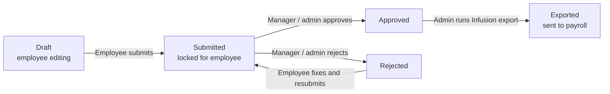
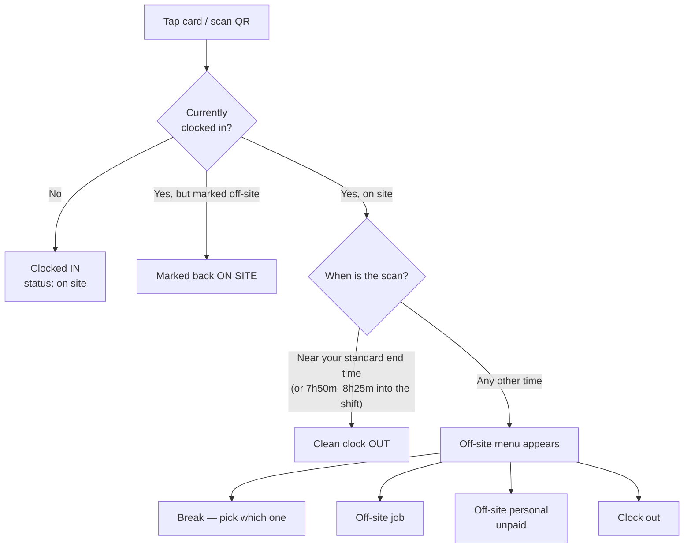
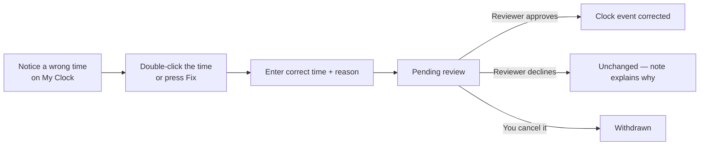
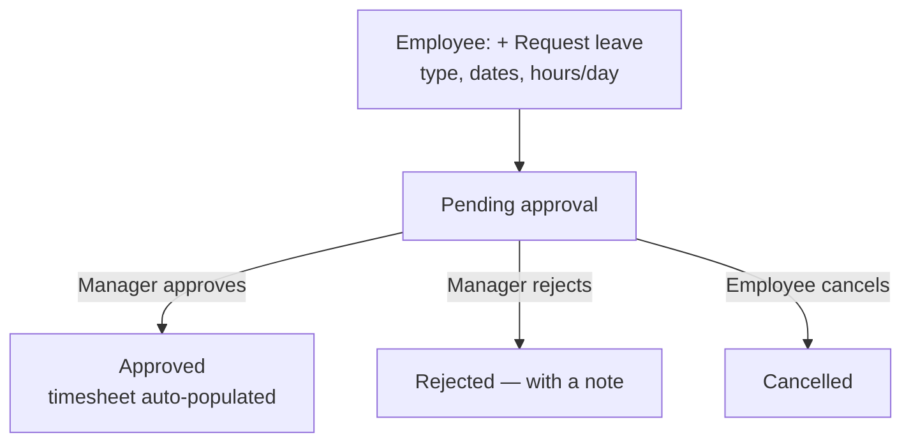
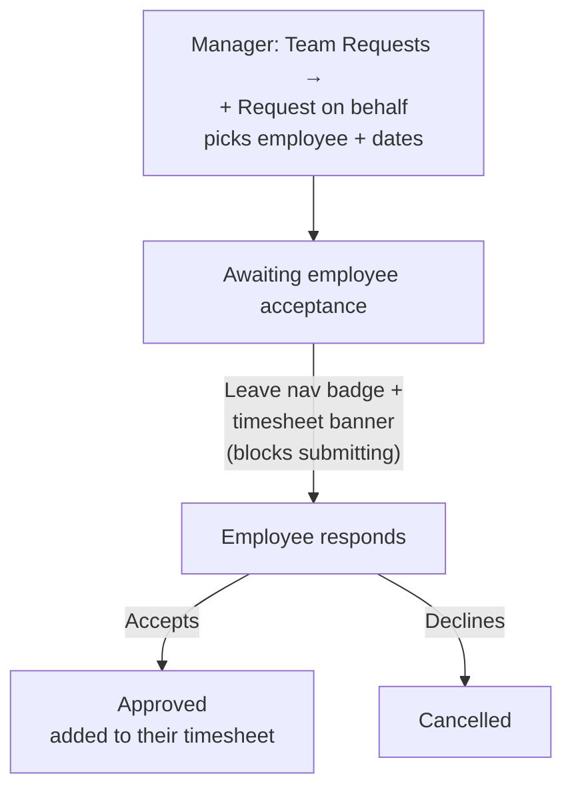
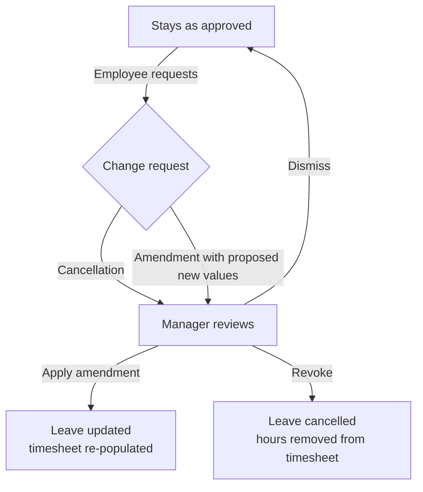
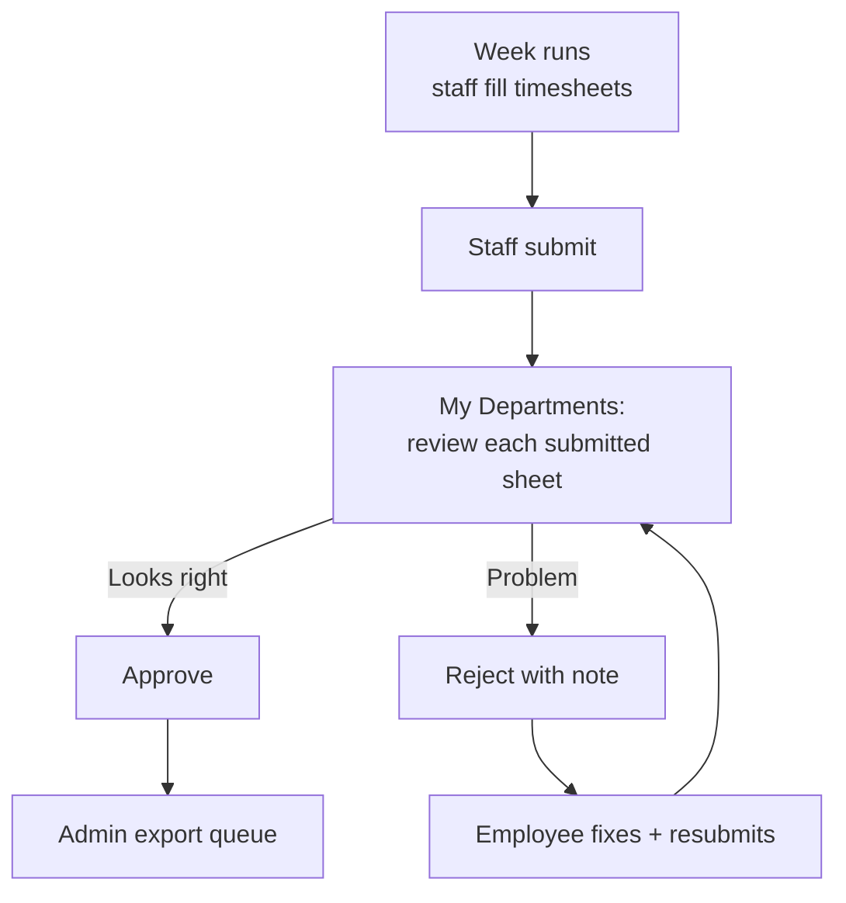
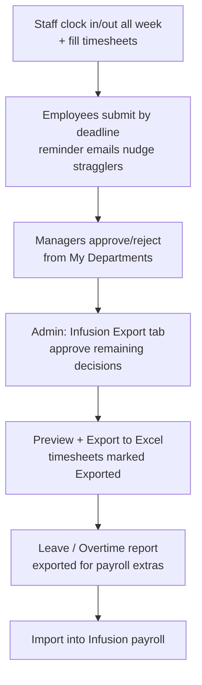

# PTL Timesheet — User Guide

How each type of user interacts with the timesheet application, with flow
charts for every major process.

The app lives at **https://ptl-timesheet.businessautomation.workers.dev** and
works alongside the **PTL Clock kiosk** (the wall-mounted clock-in/out tablet)
— both share the same database, so clock events, timesheets, and leave all
stay in sync.

---

## 1. The user types

| Role | Who they are | What they see |
|---|---|---|
| **Employee** | Everyone on the roster | My Timesheet, My Leave, My Clock, Settings |
| **Manager** | A department lead (`Manager` on a department) | Everything an employee sees, plus My Departments, Team Requests on Leave, and (if granted) the Clock tab scoped to their departments |
| **Admin** | Payroll / office administrators | Everything, org-wide: Admin dashboard, Infusion Export, Leave oversight, Leave/Overtime reports, Staff, Configure, Archive, Clock |
| **Developer** | System maintainers | Everything, plus dev-only tools (test-data generator, hard deletes, export audit logs) |
| **Overhead staff** | Staff in overhead departments (e.g. office) | Clock in/out and take leave, but do not file timesheets — their approved leave feeds reports directly |
| **Contractors** | `contractor` employment type | Timesheets only — no Leave tab (they don't accrue leave) |

Signing in: every user signs in with email + password at the sign-in page.
First-time users may be asked to change a temporary password. Forgotten
passwords are self-service via **Forgot your password?** (a reset link is
emailed — it's single-use, so open it promptly).

---

## 2. The employee's week (timesheet)

The **My Timesheet** page is a weekly grid: one row per job, one column per
day (Mon–Sun), with a Department code, Task, and Description on each row.

Key rules the grid enforces:

- **Hours are quarter-hour steps** — anything typed is rounded to the nearest
  0.25 when it saves (1.3 becomes 1.25, 2.6 becomes 2.5).
- **Every row with hours needs a job and a department code.** You cannot
  submit while a department code is missing — the app blocks it, and the
  database double-checks (nobody, not even an admin submitting on your
  behalf, can bypass it).
- **Common jobs**: the ⓘ button next to the status pill opens the common-jobs
  reference table — double-click any row in it to add that job (with its
  department letter) straight onto your timesheet.
- Rows autosave as you type; daily totals and the week total update live.
- Leave you've had approved appears automatically as pre-filled leave rows —
  you don't enter leave hours by hand.

### Timesheet lifecycle

- **Draft** — yours to edit all week.
- **Submitted** — locked; your manager reviews it. If something's wrong they
  reject it with a note and it comes back to you as **Rejected** — fix and
  resubmit.
- **Approved** — signed off, waiting for payroll.
- **Exported** — payroll has taken it; it's final. Past weeks are always
  visible in the **Archive**.

---

## 3. Clocking in and out (kiosk + My Clock)

Everyone clocks in/out at the **PTL Clock kiosk** by tapping their ID card —
or scanning their **QR code**, which every user can view from **Settings →
My clock-in QR code** (tap *QR mode* on the kiosk first). Treat the QR like
your ID card.

### What happens when you scan

- Leaving around the sanctioned end of day (including taking your final
  15-minute break by going home early) clocks you straight out — no menu.
- Leaving mid-shift, the menu asks *why* you're going: break, off-site job,
  personal (unpaid), or clocking out. Scanning again when you return marks
  you back on site.

### My Clock page

Shows your own clock events for any week. Two ways to get a wrong time
fixed:

- **Double-click any recorded time** to request a correction — even without
  a flag.
- Flagged shifts (short, or auto-closed because you forgot to clock out)
  also show a **Fix** button.

Either way you propose the correct time with a reason; a reviewer approves
or declines it. Pending requests can be cancelled from the same page until
they're actioned.

---

## 4. Leave

Leave is requested from **My Leave** and approved by **your manager** — the
manager's approval is final and instantly writes the leave hours onto your
timesheet(s) for the affected week(s).

### Requesting your own leave

While a request is pending you can cancel it yourself via the ⋯ menu.

### Manager requests leave on your behalf

Managers can raise leave *for* a team member (e.g. arranged verbally). It
lands in the employee's **My Requests** as *Awaiting your acceptance* — the
employee must accept it before it counts.

These used to get missed, so an unaccepted request is now hard to walk past:

- a **red count** sits on the **Leave** tab in the top bar,
- the request appears as a **banner on the timesheet itself** for any week it
  covers, with Accept / Decline right there,
- and that week **can't be submitted** until the employee has responded — so a
  timesheet can't go to payroll with the leave left off.

Accepting is the only thing that adds the hours; declining just closes the
request. If the week has *already* been submitted or exported, Accept is
withheld (it would rewrite a timesheet payroll has already taken) and the
banner says to ask a manager instead.

### Changing approved leave

Once leave is approved (already on your timesheet), you can't edit it —
instead you request a **cancellation** or an **amendment** (proposing new
dates/hours/type) from the ⋯ menu. Your **manager** actions these from
their Team Requests tab; admins can see everything and step in if needed.

---

## 5. The manager's job

Managers work from three places:

**My Departments** — the weekly review hub. Donut charts show how much of
each of their departments has submitted; the employee table shows each
person's status with **Approve / Reject** buttons on submitted timesheets,
and a link to view (or edit, where allowed) each timesheet.

**Leave → Team Requests** — three queues, badge-counted:
1. *Pending your review* — new leave requests. Approving populates the
   employee's timesheet immediately; rejecting returns it with a note.
2. *Change requests* — cancellations/amendments on approved leave
   (Apply / Revoke / Dismiss).
3. *Awaiting employee acceptance* — on-behalf requests you've raised.

**Clock** (if granted clock visibility) — the same reports admins see,
scoped to their departments.

### The weekly cycle, manager's view

---

## 6. The admin's job

Admins run the payroll pipeline and keep the org configured. Their pages:

**Admin → Dashboard** — live view of the selected week: which departments
and employees have submitted, everyone's status and hours at a glance.

**Admin → Infusion Export** — the payroll step. For the selected week:
review the *Pending decisions* list (approve or reject each submitted
timesheet — "Approve all" available), then **Preview** and **Export to
Excel** in Infusion's import format. Exporting flips the week's *approved*
timesheets to *Exported*.

You don't have to clear the whole list first. If some timesheets are still
undecided you can export anyway — a prompt names who's affected, their
sheets are left out of the file, and they stay in *Pending decisions*.
Approve them later and press **Export to Excel** again: because only
*approved* sheets are exportable and *Exported* ones are skipped, the second
file contains **only the newly approved rows**, so there's nothing to
de-duplicate on the Infusion side. The same is true of anyone who never
submitted.

**Admin → Leave** — org-wide leave oversight: an approvals queue (admins
can approve/reject like a manager), change requests, and a filterable
history of every request.

**Admin → Leave / Overtime** — payroll reports for leave and overtime:
- *Waged (Weekly)* and *Salaried (Monthly)* — fixed period reports.
- *Custom Report* — any date range, loaded on demand, with Excel-style
  column filters (click any header: sort, tick values, search, min/max
  hours, or pick dates from a year → month → day tree). Employment type is
  a filterable column, totals recompute as you filter, and Excel/PDF
  exports match what's on screen.

**Clock** — org-wide clock reports across six sub-tabs: **Live** (who's on
site right now, incl. the guest count), **Clock vs Timesheet** (clocked
hours against logged hours with a tolerance), **Flags** (short / late /
auto-closed shifts — a weekend is never counted short, and neither is a
shortfall that approved leave accounts for, so this stays a real chase
list), **Full report** (every employee against every weekday —
break deductions and the 15-minute early-leave credit, rounded to quarter
hours; a weekday somebody didn't clock shows a red **No Clock**, and a
weekday they clocked less than a full shift shows **Short shift** — but
approved leave settles both: a covered day shows the leave type in blue
instead, and a short shift stops being flagged once the leave hours make up
the shortfall, so you only chase what's genuinely unexplained. Weekends are
never short shifts — the threshold is a standard weekday and nobody is
rostered a full day on Sat/Sun — though a forgotten clock-out still shows
as **Auto-closed** any day of the week; weekend days appear only when
someone actually clocked), **Off-site**
(breaks, off-site jobs, personal time, genuine early clock-outs), and
**Adjustments** (approving employee time-fix requests). Each panel shows a
compact status pill summarising the view.

When someone is waiting on you to approve a time fix, a **red count** sits on
the **Clock** tab in the top bar — the same pill the Leave tab uses. It counts
only what you can actually action: org-wide for admins, or just your own
departments if your clock access is scoped that way.

**Staff** — the roster: add/deactivate staff, set department, employment
type (waged/salaried/contractor), overtime eligibility and thresholds,
rates, and manager status.

**Configure** — org setup: jobs (incl. leave-job mapping and Infusion
sync), tasks, department codes, staff types, leave types, public holidays,
approval workflow, deadlines and reminder emails, clock-vs-timesheet
tolerance, SMTP, and the Xero integration.

### The payroll week, end to end

---

## 7. Quick answers

- **I can't submit — it says a department is missing.** Fill the Department
  cell on every row that has hours (double-click a common-jobs row to get
  the right code automatically).
- **My hours changed after I typed them.** Entries snap to the nearest
  quarter hour — that's intended.
- **My clock time is wrong.** My Clock → double-click the time → propose the
  fix.
- **I need my QR code.** Settings → *My clock-in QR code* → Show.
- **Where did my old timesheet go?** Archive shows every past week.
- **Who approves my leave?** Your department manager — and the decision is
  final (no second admin step). Changes to already-approved leave also go to
  your manager.
